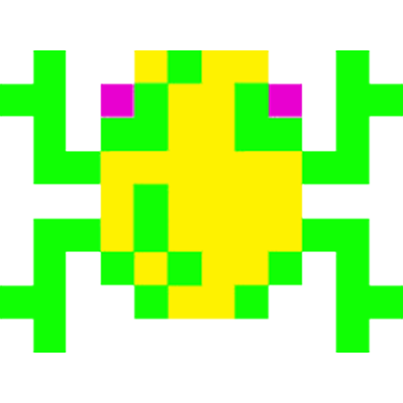
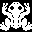
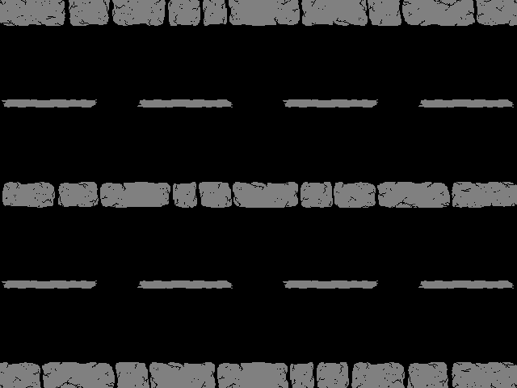
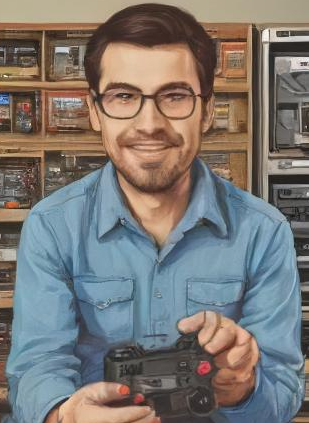
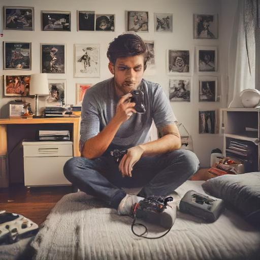
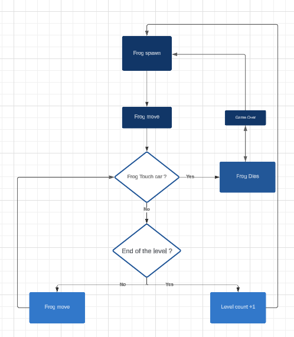

# PROJECT NAME: FROGGER
______

## *Table of Contents*

- [PROJECT NAME: FROGGER](#project-name-frogger)
  - [*Table of Contents*](#table-of-contents)
  - [I) Document Information](#i-document-information)
    - [2) Document Approval](#2-document-approval)
    - [3) Glossary](#3-glossary)
  - [II) Project Introduction](#ii-project-introduction)
    - [1) Original Frogger Definition](#1-original-frogger-definition)
    - [2) Features of the Original Game](#2-features-of-the-original-game)
  - [III) Functional Requirements](#iii-functional-requirements)
        - [➭ Player](#-player)
        - [➭ Score](#-score)
        - [➭ Cars](#-cars)
        - [➭ Environment](#-environment)
        - [➭ Objectives and Loss Conditions](#-objectives-and-loss-conditions)
    - [2) User Interface](#2-user-interface)
        - [➭ Title Screen](#-title-screen)
        - [➭ Leaderboard (Title Screen)](#-leaderboard-title-screen)
        - [➭ Font](#-font)
        - [➭ Game Score Screen](#-game-score-screen)
        - [➭ Time](#-time)
        - [➭ Lives](#-lives)
        - [➭ Game Over](#-game-over)
          - [*The background does not change*.](#the-background-does-not-change)
        - [➭ Leaderboard (Death Screen)](#-leaderboard-death-screen)
  - [IV) Project Requirements](#iv-project-requirements)
          - [We are going to recreate a box (Equivalent of the frog's sprite) and making it move. If it colides to another sprite the frog sprite restart at its spawn point.](#we-are-going-to-recreate-a-box-equivalent-of-the-frogs-sprite-and-making-it-move-if-it-colides-to-another-sprite-the-frog-sprite-restart-at-its-spawn-point)
    - [1) Analysis of Our Game](#1-analysis-of-our-game)
          - [*Because one of our Team Member (who had to make the sprites) is sick, we wont be able to provide you all the potentials sprites we will use in the game.*](#because-one-of-our-team-member-who-had-to-make-the-sprites-is-sick-we-wont-be-able-to-provide-you-all-the-potentials-sprites-we-will-use-in-the-game)
        - [➭ Player](#-player-1)
        - [➭ Score](#-score-1)
        - [➭ Cars](#-cars-1)
        - [➭ Environment](#-environment-1)
        - [➭ Title Screen](#-title-screen-1)
        - [➭ Font](#-font-1)
        - [➭ Game Score Screen](#-game-score-screen-1)
        - [➭ Time](#-time-1)
        - [➭ Game Over](#-game-over-1)
  - [V) Project Overview](#v-project-overview)
    - [A) Project Objectives](#a-project-objectives)
    - [B) Focus Areas](#b-focus-areas)
          - [*We are primarily focusing on features that replicate the original gameplay. Additional features may be included to enhance the game's originality.*](#we-are-primarily-focusing-on-features-that-replicate-the-original-gameplay-additional-features-may-be-included-to-enhance-the-games-originality)
          - [*Given the limitations of the Go\_Board, the project will not feature the same functionalities as the original game:*](#given-the-limitations-of-the-go_board-the-project-will-not-feature-the-same-functionalities-as-the-original-game)
  - [V) Personas](#v-personas)
  - [VI) Functional Analysis](#vi-functional-analysis)

## I) Document Information
| Document ID  | Document #01     |
|--------------|------------------|
| Document Owner | Julian Reine (Program Manager) |
| Creation Date | 23/09/2024      |
| Last Modification | 03/10/2024  |
| Document Name | FunctionalSpecifications |

### 2) Document Approval

| Role              | Name                       | Checked | Date     |
|-------------------|----------------------------|---------|----------|
| Project Manager    | Lucas Aubard               |      ☑️  | 04/10/2024   |
| Tech Lead          | Vivien Bistrel Tsangue     | ☑️        | 04/10/2024   |
| Software Developer  | Manech Laguens             |  ☑️       | 04/10/2024   |
| Software Developer  | Mariem Zaiane              |  ☑️       | 04/10/2024   |
| Technical Writer    | Abderrazaq Makran         |  ☑️       | 04/10/2024   |
| Quality Assurance    | Raphael Chiocchi          |  ☑️       | 04/10/2024   |
| Program Manager      | Julian Reine              |   ☑️      | 04/10/2024   |

### 3) Glossary

| Term Used         | Definition                                       |
|-------------------|--------------------------------------------------|
| "Team"            | ALGOSUP Team 3 (2024-2025 - Project 1)        |
| "Player / Frog"   | The person playing the game                     |
| "Frog"            | A small frog controlled by the player           |
| "Cars"            | The vehicles that move on the road and are the frog's enemies |
| "Map"             | The game environment                             |
| "User Interface" or "UI" | The visual and interactive elements through which users interact with the game |
| "Go_Board"       | The chip used in this project                   |
| "FPGA"           | (Field Programmable Gate Array)  integrated circuit logic who can be programmed after its manufacture.|
___________________________

## II) Project Introduction
### 1) Original Frogger Definition

* Frogger is a 1981 arcade action game developed by Konami and published by Sega. In North America, it was distributed by Sega/Gremlin. **The objective of the game is to direct five frogs to their homes by dodging traffic on a busy road**, then crossing a river by jumping on floating logs and alligators.

 

### 2) Features of the Original Game

* #### A) Objective of the Game
*  Guide five frogs across the road and the river to their homes without getting run over or drowned.

* #### B) Original Map Specifications

 * The original map consists of two parts: the road and the river.
On the road, the frog must **dodge** the cars moving on the highway. The cars come from the left and right, depending on the segment of the road. If the frog gets run over, it loses a life and restarts at the bottom of the map.
In the river section, the frog has no solid ground to walk on. It must **hop onto passing logs, turtles, and even the backs of alligators**. Logs and animals are randomized similarly to the cars. If the frog misses the logs or animals, it drowns, loses a life, and restarts at the bottom of the map. 
If the player has no lives remaining, the game stops, and a **game over** screen appears.
__________________

## III) Functional Requirements

* ### 1) Main Features Overview

##### ➭ Player
  * The player controls the frog.
  * It can move in four directions: **Up, Down, Left, and Right** using the switches on the Go_Board.
  * The player must cross the map while avoiding being killed. When the frog dies, a short animation is played.

  ##### ➭ Score
The player can **score points** by:
  * Bringing frogs home
  * Eating flies that appear on screen
  * Finishing a level 
  * Catching the Ping frog that randomly appears  on the screen.

##### ➭ Cars 

* Cars come from the **left and right**. They never stop, and the player must **move forward** to dodge them and cross the road successfully.
* If the player touches a car, **they lose a life**.

##### ➭ Environment
* The map consists of the road and the river. The player crosses from one part of the map to the other.

 

##### ➭ Objectives and Loss Conditions
*The game objectives are:*
- **Bringing home** the five frogs.
- Achieving the highest possible score. Several actions can increase the player's score. **Bringing frogs home increases the score**, but there are other ways to gain points.

__*However, there are two loss conditions:*__
- Being **touched** by a car or an enemy.
- Running **out of time**.

The player can lose **three lives** before reaching a game over.

### 2) User Interface
##### ➭ Title Screen
* The 1981 Frogger edition lacks a proper title screen. It mainly consists of the scoreboard and the high-score display.
* Thus, we used the Frogger 1991 edition to showcase a proper title screen. It features an animation of frogs transforming into the "FROGGER" logo, as shown below.

 

##### ➭ Leaderboard (Title Screen)

* The player's high score is displayed on the title screen.

##### ➭ Font
* Text is displayed using the **Frankfurter** font.

##### ➭ Game Score Screen
* At the top of the screen, **"Hi-score"** is located in the top center, referring to the **best score** the player has achieved.
* The numbers are displayed **below the text**. 
* The current score is displayed as **"I-UP,"** horizontally aligned with **"Hi-score."**
* The numbers are aligned horizontally with the numbers under **"Hi-score."**

 

##### ➭ Time
* Time is represented by a **shrinking horizontal bar** in the bottom right of the game.
* "Time" is displayed at the bottom right.
* Time is also displayed in the **middle of the screen** using numbers to indicate the remaining time before the game stops.

 

##### ➭ Lives
* The frogs' lives are displayed at the **bottom left of the game**. They are **lowercase** representations of the frogs (not moving) used to indicate the player's remaining lives
* If the player gets hit, **they lose a life**.
* If the player runs out of time, **they lose a life**.

 
 
 
 
 

* ###### *The amount of frog is the lifes remaining.*

##### ➭ Game Over
* When all the player's lives are used, a **game-over screen** will appear, displaying **"GAME OVER"** in the center.

###### *The background does not change*.

* The player is then prompted to enter their **initials** to **register their score** if it was **higher than their previous scores**.

 

##### ➭ Leaderboard (Death Screen)

* Players enter their name along with a 3-digit counter associated with their score. The player's high score will be displayed on the title screen, alongside the best score displayed in-game as "Hi-Score." 
* The leaderboard screen also feature a "Start" button to restart from there.

## IV) Project Requirements
*Disclaimer: We will focus on the main features of the game, such as gameplay, and will add secondary features, like the sprites, later if possible.* *__This means that our Frogger may potentially be minimalist if we do not have enough time.__*

###### We are going to recreate a box (Equivalent of the frog's sprite) and making it move. If it colides to another sprite the frog sprite restart at its spawn point.
### 1) Analysis of Our Game
____________________________
  ###### *Because one of our Team Member (who had to make the sprites) is sick, we wont be able to provide you all the potentials sprites we will use in the game.*
  _____________________________

* #### A) Main Features Overview

##### ➭ Player
  * The frog will behave similarly to the original game's frog. We have only changed the sprite of the frog.

*__The frog will move according to:__*

##### ➭ Score
* In our version, the player can **score points** by:
- Finishing a level (They earn 1 point per level).

##### ➭ Cars 

* Similar to the original game, the cars are randomized.

##### ➭ Environment
* Our Frogger map will resemble the original game but will be limited by the Go_Board's lower resolution so we remade only the road part.

 

* ### B) User Interface

##### ➭ Title Screen
* Our game will feature a simple title screen with a "Start" and "Exit" button. The game name will be displayed in the center.
Pressing the top left switch will start the game.

 

##### ➭ Font
* Text will displayed using **Frankfurter**, just like in the original game.

##### ➭ Game Score Screen
* In-game, the score counter will be displayed at the top right of the screen, showing the score in numbers. We wont include a leaderboard system, such as a Hi-Score module.

 

##### ➭ Time
* The time in our game will be displayed in numbers at the bottom right of the screen.

 

##### ➭ Game Over
* A black screen will appear showing "Game Over."

 

## V) Project Overview

* *As you can see, some features of the original game are not present. Our Frogger may be minimalist because we are unsure of the limits of the Go_Board, but we will try to make it as accurate as possible:*
- Using FPGA / Verilog in Visual Studio.
- Must work on a Go_Board chip
  
### A) Project Objectives

- Create a working Frogger that closely replicates the 1981 version using the Go_Board.
- Include features that are true to the game while adhering to the VGA display output and the Go_Board's capacity.
- Utilize most of the Go_Board's features, such as the two-digit LED panel (If possible, to display the level number).
- Implement a score counter displayed at the top right of the screen.

### B) Focus Areas

| Focusing On                                                                                  |
|---------------------------------------------------------------------------------------------|
| Delivering a Frogger that works on the Go_Board chip, displayed on VGA output              |
| Must be programmed in Verilog with FPGA on the Go_Board                                               |
| Including features such as death animations and custom models for cars                      |

| Out of Focus                                                                                |
|---------------------------------------------------------------------------------------------|
| Recreating the first frog animation, including the title screen animation                  |
| Redoing the Frogger maps                                                                    |
| Multiplayer (2 players as in the original)                                                |
| Advanced decoration                                                                         |

###### *We are primarily focusing on features that replicate the original gameplay. Additional features may be included to enhance the game's originality.*

* ### C) Project Restrictions
* The level are **randomized**, but due to the limitations of the Go_Board, we will not include different landscapes such as the river and its contents. The cars will be represented in 7x8 pixels, while the frog will be 8x8 pixels.

* ### D) Project Analysis
* Our project will include a black background/ grid (at first glance) where the frogs will cross.
* Cars will pass in a random cycle, making the game unpredictable.
* The levels will **increase in speed**.
(Idea for speed increase: Level 1: Speed of 100. Every two levels, the speed increases by 2%, reaching a maximum value of 150%, otherwise, the frog won't be able to cross the road and will be instantly killed.)

###### *Given the limitations of the Go_Board, the project will not feature the same functionalities as the original game:*
- To finish a level, only one frog is required to cross the road.
- No death screen will be displayed (at first glance).
- No leaderboard will be included.
_____________________

## V) Personas

Personas of the possible audience our game can touch.
|Name : | Nostalgic Nick 
-------------------|--------------------------------------------------|
Full Name: | Nick Thompson, 38 years old
Occupation:| Computer scientist, he worked on important projects
Gaming Background:| Nick grew up in a small town during the 1990s, where he spent countless hours at the local arcade, reveling in the glow of pixelated screens. "Frogger" was one of his all-time favorites, and he has fond memories of racing against friends to see who could get the highest score.
Context:| When walking past a gaming store, Nick unlocked an old memory of him when he was playing the Frogger with his friends on the arcade machine. He decided to search on the internet for an online version of this game and played all day long, just like when he was young.

 

___________________________
Name:| Noobiam|
-------------------|--------------------------------------------------|
Full Name: |Liam, 20 years old
Occupation:| College student, majoring in Computer Science
Gaming Background:| Grew up on modern consoles, PC games, and mobile games. He's never played arcade games, except the digital versions of some classics on his phone.
Context:| Liam is at a retro gaming night with his friends. They're going through old games when someone mentions Frogger. Liam’s intrigued because he's never heard of it. He’s used to stunning graphics, expansive worlds, and complex narratives, so he can't imagine what a game from the '80s could offer.

 

-----------------------
## VI) Functional Analysis

 

