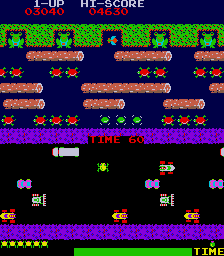
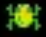
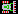
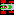
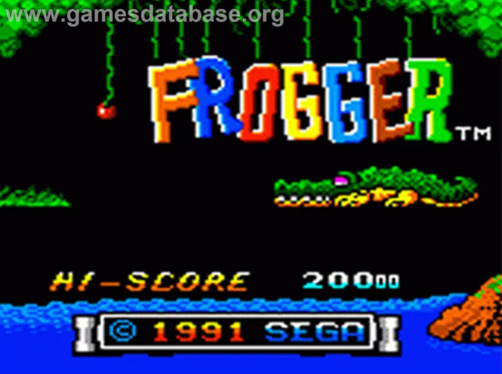
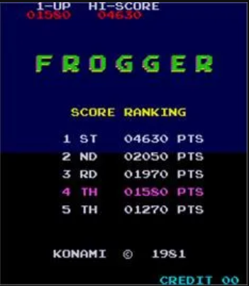
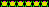
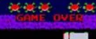
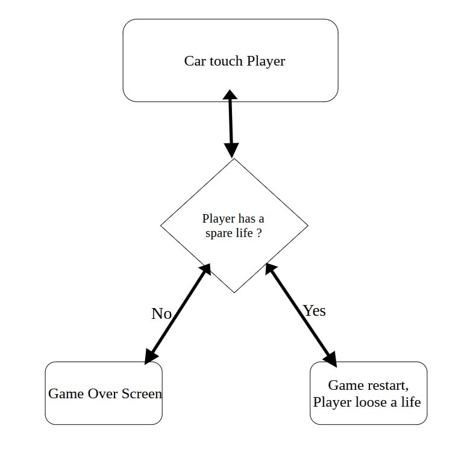

# PROJECT NAME: FROGGER

## *Table of content*

- [PROJECT NAME: FROGGER](#project-name-frogger)
      - [CONTENT TABLE](#content-table)
  - [Table of content](#table-of-content)
  - [I) Document Informations:](#i-document-informations)
    - [2) Doc Approval](#2-doc-approval)
    - [3) Glossary](#3-glossary)
  - [II) Project Intro:](#ii-project-intro)
    - [1) Original Frogger Definition](#1-original-frogger-definition)
    - [2) Features of the game (original) Including pics](#2-features-of-the-game-original-including-pics)
      - [A) Objective in the game](#a-objective-in-the-game)
      - [B) Original Map specifications](#b-original-map-specifications)
  - [III) Functional Requirements](#iii-functional-requirements)
    - [1) Main features Over view](#1-main-features-over-view)
        - [➭ Player](#-player)
        - [➭ Score](#-score)
        - [➭ Cars](#-cars)
        - [➭ Environement:](#-environement)
        - [➭ Objectives and loss condition](#-objectives-and-loss-condition)
    - [2) User Interface](#2-user-interface)
        - [➭ Title Screen](#-title-screen)
        - [➭ Leaderboard (Title screen)](#-leaderboard-title-screen)
        - [➭ Font](#-font)
        - [➭ Game Score](#-game-score)
        - [➭ Time](#-time)
        - [➭ Lifes](#-lifes)
        - [➭ Game Over](#-game-over)
        - [➭ Leaderboard (Death Screen)](#-leaderboard-death-screen)
  - [IV) Project Requirement](#iv-project-requirement)
    - [1) Project Overview](#1-project-overview)
    - [2) Project Objectives](#2-project-objectives)
    - [3) Focus on](#3-focus-on)
    - [4) Restriction of the project](#4-restriction-of-the-project)
  - [V) FUNCTIONAL ANALYSIS:](#v-functional-analysis)
  - [VI ) MATERIAL:](#vi--material)

 

## I) Document Informations:
| Document ID | Document # 01 |
|---|---|
| Document Owner | / |
| Issue date | / |
| Last Issue Date | / |
| Document Name | Functional_Specifications|

### 2) Doc Approval

| Role | Name | Checked | Date |
|---|---|---|---|
| Project Manager | Lucas AUBARD |  | //2024 |
| Tech Lead | Vivien Bistrel TSANGUE |  | //2024 |
| Software Developer | Manech LAGUENS |  | //2024 |
| Software Developer | Mariem ZAIANE | | //2024 |
| Technical Writter | Abderrazaq MAKRAN |  | //2024 |
| Quality Assurance | Raphael Chiocchi ||//2024 |
| Program Manager | Julian REINE ||//2024 |

### 3) Glossary

| Term used | Definition |
|---|---|
| "Team" | ALGOSUP team 3 (2024-2025 - Project 1) |
| "Player / Frog" | The person playing the game |
| "Frog" the character | A little frog controlled by the player |
| "Cars / Buses" | The cars are running on the road, and are the frog's enemy |
| "Map" | The game environment  |
| "User Interface" or "UI" | The visual and interactive elements through which users interact with the game |
| "Go_Board" | The Chip used in the process of this project |
| "FPGA" | (Field.Programable.Gate.array) Programming language used in the project |

## II) Project Intro:
### 1) Original Frogger Definition

 Frogger is a 1981 arcade action game developed by Konami and published by Sega. In North America, it was distributed by Sega/Gremlin. __The object of the game is to direct five frogs to their homes by dodging traffic on a busy road__, then crossing a river by jumping on floating logs and alligators. 

 
 

### 2) Features of the game (original)
#### A) Objective in the game
 Make five frogs crossing the road, and the river to their home whiout getting run over or drowned in the river.

#### B) Original Map specifications

The original map is composed of two parts. The road, and the River.
On the road, The Frog must __dodge__ the cars going on the highway. The cars are coming from left and right; depends on segment of the road you are. If the frog get runned over, it loose a life and restart in the bottom of the map.
On the river Part, the Frog doesn't have a solid base the frog can walk on to. The Frog must __walk on passing by logs, turtles and even the back of alligators__. Logs and animal are randomised in the same way as the cars are. If you miss the logs or animal, the frog drown and you loose a life and restart in the bottom of the map. 
If the player doesn't have any lifes remaining, the game stop and a __game over__ screen appears.

## III) Functional Requirements

### 1) Main features Over view

##### ➭ Player
The player plays the Frog.
It can move in four directions: __Up, Down, Left and Right__.
The player must cross the map avoiding being killed.
When the Frog dies, a little animation is played.

( WIP for the more specificities of the frog)

 
  

##### ➭ Score
The player can __score points__ by:
* Bringing back frogs home
* Eating fly that pass some time on screen
* Finishing a level

 
  

##### ➭ Cars 

Cars are coming from the __left and right__. They never stop by, and the player must __move forward__ dodging them to cross the road successfuly.
If the player touch a car, __he loose a life__.

##### ➭ Environement:
The map is composed of the road and the river. The player cross the path into the other part of the map.

 
 

##### ➭ Objectives and loss condition
*The game objectives are :*

* __Bringing Home__ the five Frogs.

* Get the highest possible Score. Several actions will let the player increase their score. **Bringing Frogs home will increase the player score** but it also can increase by other ways.

*But There is two loss conditions* : 
* Being **touched** by a car or an entity.
* Running **out of time.**
  
The player can lose **3 lifes** before getting a game over.

### 2) User Interface
##### ➭ Title Screen
Title screen is mostly composed of an animation with frogs transforming into the "FROGGER" logo as you can see below

 
 

##### ➭ Leaderboard (Title screen)

 The player High-Score is displayed on the title screen.

 

 
 

##### ➭ Font
Text is displayed using **Frankfurter** font. 

##### ➭ Game Score Screen
At the top of the screen. **"Hi-score"** is in the top center of the screen and refers to the Best score the player ever had.
The number are displayed **below the text**. 
The current score should be displayed as **"I-UP"**, horizontally aligned with "Hi-score".
The numbers are displayed horizontally aligned with the numbers under **"Hi-score"**.

 
 

##### ➭ Time
Time is represented by a **shrinking horizontal bar** in the bottom right of the game.
"Time" is displayed on bottom right.
Time is also displayed in the **middle of the screen** showing with Numbers the time remaining before the game stops.

 
 

##### ➭ Lifes
The frogs lives are displayed on **bottom left of the game**. They are **lower case** models of the frogs (Not moving) and are used to display the players lifes remaining.
If the player gets hit, **he loose a life**.
If the player run out of time, **he loose a life**

 
 

##### ➭ Game Over
When all the player's life are used, a **game-over screen** will appear. The words **"GAME OVER"** appear in the middle of the screen.

*The back ground model doesn't change*.

The player is then asked to enter is **Initials** to **register his score** if it was **Higher than the scores he did before**.

 
 

##### ➭ Leaderboard (Death Screen)

Enter The player name: The player enter his name with the 3 digits counter associated with the score he made. The player High-Score will be displayed on the title screen, as well with the best score displayed in game as "Hi-Score".
The leaderboard screen has also a "Start" buttom to restart from there.

## IV) Project Requirement 
### 1) Project Overview
* Making a Frogger Clone game
* Using FPGA / Visual Studio.
* Has to work on a Go_Board Chip 
### 2) Project Objectives

* Creating a working frogger and making it accurate to the 1981's version by using the Go_Board.
* Including differents features that are accurate to the game with the restriction of the VGA display output and the Go_Board capacity
* Most The Go_Board features such as the two digits LED pannel has be used. 
*  A score counter displayed on screen top right.
### 3) Focus on

| Focusing on |
|---|
| Delivering a clone of Frogger that works on the Go_Board Chip, and displayed on VGA output |
| Must be programed with FPGA on the Go_Board |
|Including features such as death animation and customs models for cars|

| Out of focus |
|---|
| Re-Doing the frogger maps |
| Multiplayer (2 players as original) |
| Advanced decoration |

 *We are mostly focusing on the features that replicate the original gameplay. We might add some features that the team want to add to make the game original.*
### 4) Restriction of the project
 The level is not **randomised**. We wont include different landscape such as the river and its content. We wont include any decoration of the map in the game. The cars will be in 7 by 8 bits while the frog will be 8 by 8bits.

## V) FUNCTIONAL ANALYSIS:

 
 

