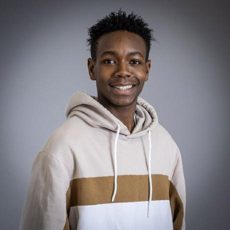
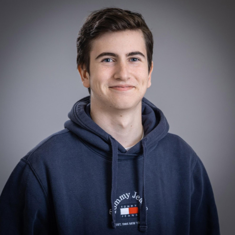
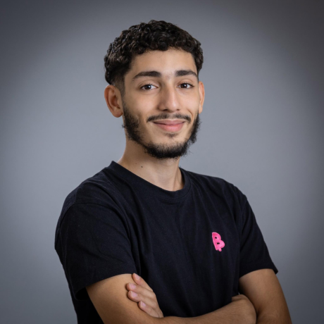

# Project Charter Team 3 - Verilog Frogger

## Document Information

|                | Information  |
| -------------- | :----------: |
| Document Owner | Lucas AUBARD |
| Creation Date  |  09/24/2024  |
| Last Update    |  09/24/2024  |

## Team

| Picture                                             | Name                   | Role                |
| --------------------------------------------------- | ---------------------- | ------------------- |
|       | Lucas AUBARD           | Project Manager     |
|       | Julian REINE           | Program Manager     |
|    | Vivien Bistrel TSANGUE | Technical Leader    |
|     | Manech LAGUENS         | Software Engineer 1 |
|     | Mariem ZAIANE          | Software Engineer 2 |
|  | Abderrazaq MAKRAN      | Technical Writer    |
|   | Raphaël CHIOCCHI       | Quality Assurance   |

## Document Approval

|        Role         |    Date    | Approval |
| :-----------------: | :--------: | :------: |
|   Project Manager   | 09/24/2024 |          |
|   Program Manager   | 09/24/2024 |          |
|  Technical Leader   | 09/24/2024 |          |
| Software Engineer 1 | 09/24/2024 |          |
| Software Engineer 2 | 09/24/2024 |          |
|  Technical Writer   | 09/24/2024 |          |
|  Quality Assurance  | 09/24/2024 |          |

 

 Table Of Contents 

## Project Overview

### Project Overview

The project consists of creating a game of Frogger in Verilog. The game will be displayed on a VGA screen and the player will be able to move a frog on the screen. The frog will have to avoid obstacles to reach the other side of the screen. The game will be controlled by the buttons on the FPGA board.

### Project Objectives

This project aims to developp a Frogger game that will:

- Display a main menu on the screen.
- Allow the player to move a frog on the screen in four directions.
- Display obstacles on the screen like cars and logs.
- Allow the frog to eat flies to gain points.
- Display the score on the screen.
- Display the number of lives left on the screen.
- Display the level on the screen.

## Stakeholders

| Name    | Role        | Represented By | Contact                    | Expectation                                             |
| ------- | ----------- | -------------- | -------------------------- | ------------------------------------------------------- |
| ALGOSUP | Third-Party | Franck JEANNIN | franck.jeannin@algosup.com | The third-party expect us to developp the Frogger game. |

## Milestones

Here are the milestones of the project:

| Deliverable              | Description                                                                                                                   | Deadine    |
| ------------------------ | ----------------------------------------------------------------------------------------------------------------------------- | ---------- |
| Functional Specification | It's a document that explain all the functional requirements of the game.                                                     | 10/07/2024 |
| Technical Specification  | It's a document that explain all the technical requirements of the game.                                                      | 10/14/2024 |
| Test Plan                | It's a document that explain how and when the game will be tested. All the test cases will be available in this document.     | 10/21/2024 |
| Code                     | The source code of the game.                                                                                                  | 10/21/2024 |
| User Manual              | It's a document made for the end user that will explain how to use it and also all the information he needs to know about it. | 10/21/2024 |

The end of the project is scheduled for 10/25/2024. We will present the final product this day.

## Constraints

Here are the constraints of the project:

- The project must be completed by 10/21/2024.
- The project must be developed in Verilog.
- The game must be displayed on a VGA screen.
- The game must be controlled by the buttons on the FPGA board.

## Risks

Here are the risks of the project:

| **Risk Category**       | **Risk**                    | **Likelihood** | **Impact** | **Description**                                                                                  | **Mitigation**                                                                                     |
| ----------------------- | --------------------------- | -------------- | ---------- | ------------------------------------------------------------------------------------------------ | -------------------------------------------------------------------------------------------------- |
| **Technical Risks**     | Verilog Complexity          | High           | High       | Verilog is difficult to work with for complex game logic, potentially causing delays and errors. | Conduct early research, break tasks into smaller parts, and allocate time for debugging.           |
|                         | FPGA Board Malfunction      | Medium         | High       | FPGA hardware could malfunction, causing delays in development and testing.                      | Regularly test on the FPGA, have a backup board available.                                         |
|                         | VGA Screen Display Issues   | Medium         | Medium     | Configuration issues could cause display errors or visual bugs on the VGA screen.                | Allocate time to test the VGA screen early and verify its functionality regularly.                 |
| **Timeline Risks**      | Deadline Overrun            | High           | High       | Tight deadline of 10/21/2024 might be missed due to unforeseen delays.                           | Break tasks into smaller milestones, monitor progress regularly, and avoid feature creep.          |
|                         | Testing Delays              | Medium         | High       | Insufficient time for testing may lead to missed bugs or performance issues.                     | Start testing early in parallel with development to ensure ample time for quality assurance.       |
| **Resource Risks**      | Team Skill Gaps             | Medium         | Medium     | Uneven team experience with Verilog or FPGA could slow down progress.                            | Assign tasks based on skills, conduct internal workshops, and encourage knowledge sharing.         |
|                         | Team Availability           | Low            | High       | Unexpected team member absences may create bottlenecks in the development process.               | Delegate tasks effectively and consider overlapping responsibilities to ensure project continuity. |
| **Project Scope Risks** | Feature Creep               | Medium         | Medium     | Adding more features (levels, effects) could lead to an increased workload and delays.           | Stick to the predefined scope and evaluate feature requests based on feasibility and time limits.  |
| **External Risks**      | Third-Party Dependencies    | Low            | Medium     | Stakeholder (ALGOSUP) might request changes that add complexity or increase the workload.        | Maintain clear communication and document any scope changes with agreement from the team.          |
|                         | Hardware Procurement Issues | Low            | High       | Delays in obtaining hardware like FPGA boards or VGA screens could halt project progress.        | Procure hardware early and maintain backups of essential equipment.                                |

## Responsibilities

You can find the responsibilities of each team member in the [RACI Matrix](!https://docs.google.com/spreadsheets/d/1DKpMLZC9oDSRmFd0FZSqa0wa1sUc6roZFwzoa_7gP6o/edit?usp=sharing).

## Conclusion

This project aims to develop a Frogger game in Verilog that will be displayed on a VGA screen. The game will be controlled by the buttons on the FPGA board. The project has a tight deadline of 10/21/2024, and the team will work together to overcome the risks and constraints to deliver a high-quality product. The team is excited to work on this project and looks forward to presenting the final product on 10/25/2024.