# Technical Specification for an FPGA Game project

| Role               | Name                     | Signature  | Date       |
| ------------------ | ------------------------ | ---------- | ---------- |
| Project Manager    | Lucas Aubard             | ✅         | 09/26/2024 |
| Program Manager    | Julian Reine             | ✅         | 09/26/2024 |
| Tech Lead          | Tsangue Vivien Bistrel   | ✅         | 09/26/2024 |
| Software Developer | Manech Laguens           | ✅         | 09/26/2024 |
| Software Developer | Mariem Zayenne           | ✅         | 09/26/2024 |
| Quality Assurance  | Raphaël Chiocchi         | ✅         | 09/26/2024 |
| Technical Writer   | Abderrazaq Makran        | ✅         | 09/26/2024 |

## Table of Contents

- [Technical Specification for an FPGA Game project](#technical-specification-for-an-fpga-game-project)
  - [Table of Contents](#table-of-contents)
  - [I. Introduction](#i-introduction)
    - [1. Project Brief](#1-project-brief)
    - [2. Overview](#2-overview)
    - [3. Game Specifications](#3-game-specifications)
    - [4. Objective](#4-objective)
    - [5. Requirements](#5-requirements)
    - [6. Hardware \& Software requirements](#6-hardware--software-requirements)
      - [a. Hardware](#a-hardware)
      - [b. Software](#b-software)
    - [7. Target Audience](#7-target-audience)
  - [II. System Overview](#ii-system-overview)
    - [1. System Architecture](#1-system-architecture)
    - [2. Software setting up Design](#2-software-setting-up-design)
      - [a. Setting up the software environment.](#a-setting-up-the-software-environment)
      - [b. Design](#b-design)
  - [III. Project Requirements:](#iii-project-requirements)
    - [1. FPGA notions.](#1-fpga-notions)
      - [a. Binary:](#a-binary)
      - [b. Gate Operations:](#b-gate-operations)
      - [c. The Clock:](#c-the-clock)
      - [d. LUT:](#d-lut)
      - [Why Understanding LUTs is Essential](#why-understanding-luts-is-essential)
      - [e. Flip-flop:](#e-flip-flop)
    - [2. Gameplay Requirements.](#2-gameplay-requirements)
      - [a. Player Movement:](#a-player-movement)
      - [b. Obstacle Movement:](#b-obstacle-movement)
      - [c. Levels of Difficulty:](#c-levels-of-difficulty)
    - [3. Display Requirements](#3-display-requirements)
      - [a. VGA Display:](#a-vga-display)
      - [b. Sprite Graphics:](#b-sprite-graphics)
    - [4. Debouncing Logic:](#4-debouncing-logic)
      - [a. Steps for Implementing Debouncing](#a-steps-for-implementing-debouncing)
      - [b. Applying Debouncing in Frogger Game:](#b-applying-debouncing-in-frogger-game)
    - [5. Game States](#5-game-states)
      - [a. Initialization:](#a-initialization)
      - [b. Playing:](#b-playing)
      - [c. Game Over or Level Completion](#c-game-over-or-level-completion)
    - [6. Timing and Synchronization](#6-timing-and-synchronization)
    - [7. Folder structure](#7-folder-structure)
  - [IV. Module Breakdown](#iv-module-breakdown)
    - [1. Top-Level Module](#1-top-level-module)
    - [2. Modules and Submodules files name.](#2-modules-and-submodules-files-name)
  - [VII. Implementation Details](#vii-implementation-details)
    - [1. Finite State Machines (FSMs)](#1-finite-state-machines-fsms)
      - [a. IDLE](#a-idle)
      - [b. INIT (Initialization State)](#b-init-initialization-state)
      - [c. PLAYING](#c-playing)
      - [d. LEVEL\_COMPLETE](#d-level_complete)
      - [e. GAME\_OVER](#e-game_over)
      - [f. Output Signals and Actions in Each State](#f-output-signals-and-actions-in-each-state)
      - [g.  Clock Synchronization and Timing](#g--clock-synchronization-and-timing)
      - [h. Conclusion](#h-conclusion)
  - [VIII. Testing and Validation](#viii-testing-and-validation)
    - [1. Testbench Design](#1-testbench-design)
      - [a. **Structure of a Testbench**](#a-structure-of-a-testbench)
      - [b. **Modular Testing Approach**](#b-modular-testing-approach)
      - [c. Edge Case Testing](#c-edge-case-testing)
      - [d. Testbench Execution on EDAPlayground](#d-testbench-execution-on-edaplayground)
  - [IX. Conclusion](#ix-conclusion)
  - [X. Glossary](#x-glossary)

## I. Introduction

### 1. Project Brief
We have been assigned the task of developing a Frogger game on an FPGA Go Board as project. The game’s primary goal is to successfully guide a frog across a busy road, using the FPGA's button to controller , while skillfully avoiding oncoming traffic. The frog must reach the other side of the road safely without colliding with any vehicles.

The FPGA platform will handle the game’s logic, control mechanisms, and visuals. Our design will incorporate a combination of hardware and software components to ensure smooth interaction between the player's input and the frog's movement.

### 2. Overview
The game will run on an FPGA development board, specifically the Go Board from [NANDLAND](https://nandland.com). Using the buttons on this board, the player will control the movement of a frog: one button for moving left, one for right, one for up, and one for down. The game will be displayed on a VGA monitor, where cars will appear from either the left or right side of the screen. When the frog reaches the top of the screen, the level increases, making the game progressively more challenging.

### 3. Game Specifications
The Go Board's VGA connector will be connected to an external VGA monitor for display. If using an HDMI monitor, a "VGA to HDMI" converter can be used.

The Game Board is a 20 x 15 grid, meaning that the cars and the frog can occupy 20 locations on the X-axis and 15 locations on the Y-axis. The VGA display resolution is 640 x 480 pixels, and the size of the frog will be 1x1 grid size. This means the frog will be 32 pixels wide (640 / 20 = 32) and 32 pixels tall (480 / 15 = 32), making it a square.

The game can be reset to the beginning at any time by pressing all four buttons simultaneously Switch1(SW1) & Switch2(SW2) & Switch3(SW3) & Switch4(SW4).

The VGA display is an RGB display with 3 bits per color channel. This means each channel (Red, Green, and Blue) supports 8 colors (2^3 = 8), and by mixing these, the display can support up to 512 colors (8^3 = 512).

### 4. Objective
- The frog should be represented as a sprite that looks like a real frog, with detailed colors.

- Up to 16 cars should be visible on the screen at a time, each capable of moving at different speeds.

- The game should include at least 8 levels. As the level increases, the difficulty should rise, with cars moving faster and their numbers increasing.

### 5. Requirements

- The frog should be displayed as a 1x1 grid on the VGA screen, with each grid cell being 32x32 pixels. The frog must be white.

- There should be up to sixteen cars visible on the screen at a time. The car should also be drawn as a 1x1 grid (32x32 pixels) and be white in color.

- The game should include at least one level. The game is complete when the frog successfully reaches the top of the screen.

### 6. Hardware & Software requirements
#### a. Hardware
- FPGA NANDLAND Go Board
- Monitor
- VGA-to-VGA cable
- VGA-to-HDMI adapter for HDMI monitor

#### b. Software
- Visual Studio Code .
- Verilog programming language.
- Github desktop and Github (online)
- Verilog-HDL/SystemVerilog extension.
- Simulation software: [EDAplayground](https://edaplayground.com)

### 7. Target Audience
This document is intended for a diverse audience, primarily software engineers and quality assurance who are involved in the development, testing, and maintenance of software systems. It is designed to provide detailed technical information that will assist developers in understanding and implementing the required specifications, as well as ensuring that the system meets quality standards through comprehensive testing and validation processes.

Additionally, this document is relevant to ALGOSUP.

## II. System Overview
### 1. System Architecture
The image below provides a high-level block diagram of the system, showing interaction between the FPGA, input devices (buttons/switches), display (VGA), and game logic.

### 2. Software setting up Design
#### a. Setting up the software environment.
- **MAC OS:**
  - Install Visual Studio Code
  - Go to the Homebrew website.
  - Open the terminal and paste the command you copied from the Homebrew website to install Homebrew.
  - Install Python using the command:

            brew install python

  - Install pip using the command:

            brew install pip
  - Install apio using the command:

        pip3 install apio

  - If you get errors about missing dependencies, use the command:

        pip3 install scons python-serial

  - In case conflicts arise due to pre-existing packages, use a Python virtual environment:

            python3 -m venv apio-env
            source apio-env/bin/activate
            pip3 install apio

- **Windows:**
  - Install Visual Studio Code
  - Install python
  - Open a terminal (cmd) and run:

            pip install apio

  - After installation, initialize Apio using the command:

            apio install system scons icestorm iverilog drivers

  - Install a USB driver using the command:

            apio drivers --serial

- Open Visual Studio Code.
- Create a folder and name it "**And Gate Operation**"
- Inside the "**And Gate Operation**" folder, create a simple ***Verilog*** file(And_Gate.v)
- The **.v** extension is used for all Verilog files.

            /*The following code perform a simple AND operation gate*/

            module And_gate(
                input a, 
                input b, 

                output y
            );

                assign y = a & b;

            endmodule

- Inside the "**And Gate Operation**" folder, create a ***pcf*** file and name it "**Go_Board_Constraints.pcf**". And then use the code below.

            ### LED Pins:
            set_io o_LED_1 56
            set_io o_LED_2 57
            set_io o_LED_3 59

            ### Push-Button Switches
            set_io i_Switch_1 53
            set_io i_Switch_2 51
            set_io i_Switch_3 54
            set_io i_Switch_4 52

- Connect your board to your pc via USB.
- Open the terminal on your pc and and enter the command:

            apio init -b "go-board" -t "And_gate"

            apio upload

   **Comment section:**

       After writing apio init -b "go-board" -t, the next word in quotes should always be the name of the module you want to run. In our case, the module's name is And_gate, so the complete command will be apio init -b "go-board" -t "And_gate".

    **NB:**
   - Type one command at a time. First, enter "**apio init**", press Enter, and wait to see the result. After that, type in apio upload.

   - The command **apio init -b "go-board" -t "And_Gate"** initializes a new project for the NANDLAND Go Board with an AND gate template.

   - The command apio upload transfers your Verilog design to the FPGA board, effectively programming the board to function according to your design.

After running the apio upload command, the image below shows what you should see in your terminal.

  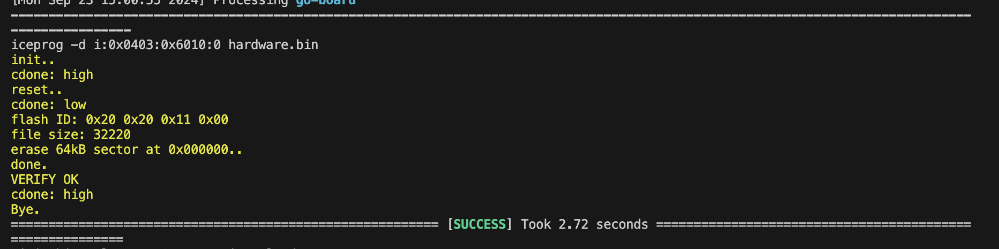

#### b. Design
Before explaining the overall structure and how the hardware will control the game input, game logic, and display output, we will first explain what an FPGA Go Board is. FPGA stands for Field-Programmable Gate Array. It is a type of integrated circuit that allows users to configure and reconfigure its hardware logic to perform specific tasks after manufacturing. This configuration is done using a hardware description language (HDL), such as Verilog or VHDL. In our case, we will use Verilog to carry out the project.

- **Key Points for Explaining an FPGA:**

  - ***Reprogrammable Hardware:***
    Unlike traditional chips that come with fixed functionality, FPGAs are flexible. They can be programmed and reprogrammed to perform different tasks, even after they've been deployed in a system.

  - ***Parallel Processing:***
FPGAs can execute many tasks simultaneously. Unlike a CPU, which processes instructions one after another, FPGAs can handle multiple operations at once, making them highly efficient for specific applications.

  - ***Custom Logic Design:***
With FPGAs, you can design your own digital circuits. Instead of being restricted to predefined functions like with standard processors, you can define how the logic gates and circuits inside the FPGA behave.

  - ***Used in Various Applications:***
FPGAs are used in a wide range of fields, from telecommunications and data centers to automotive systems and video processing. They're ideal for applications that need high-speed processing and the ability to change functionality over time.

  - ***Hardware Description Languages (HDL):***
To program an FPGA, you don't write software as you would for a CPU. Instead, you describe the hardware using HDLs like Verilog or VHDL, which defines how the logic gates and other components should connect and behave.

  - ***High Performance for Specialized Tasks***:
FPGAs are especially useful for tasks that require real-time processing and high speed, like video encoding, signal processing, or machine learning inference.

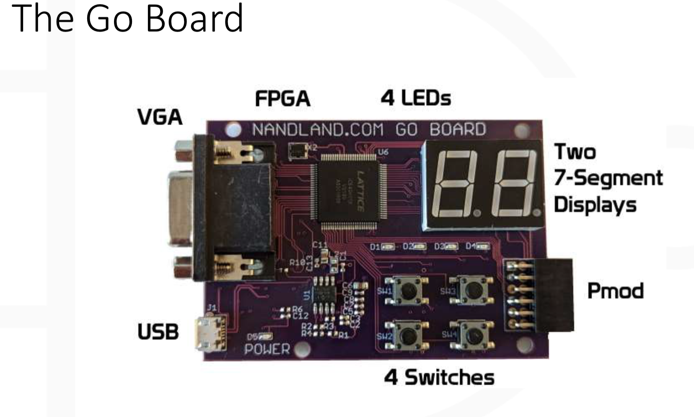

As shown in the image above, there are names surrounding the FPGA board. We will explain in details their roles in this project, including how, where, and when they will intervene.

- **Game structure:**

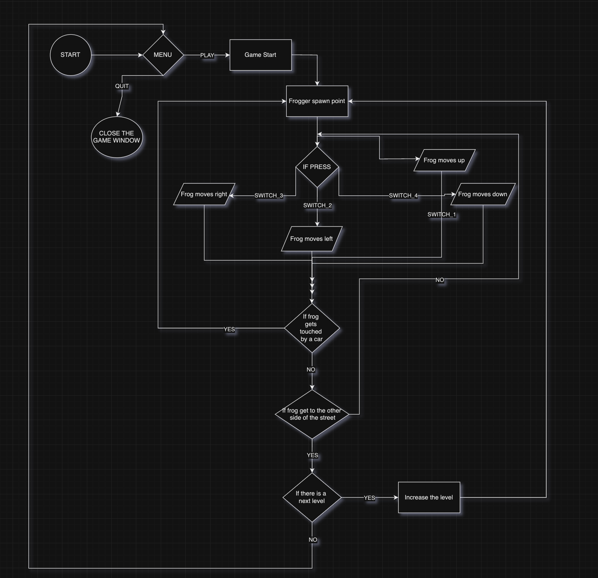

The image above presents a flowchart representation of the Frogger game and how it will function. When we run the command **apio upload,** the game will start and be displayed on the monitor. A menu will appear with two options: **PLAY** or **QUIT**.

The game starts when the player presses **PLAY**, and the frog will spawn at the bottom of the monitor (on the street). There will be at least six roads: three for cars moving from left to right and three for cars moving from right to left. The switches will control the frog's movement, and the objective is to make the frog reach the top of the screen (the other side of the road).

Each time the frog successfully reaches the other side of the road, it will respawn at the bottom of the monitor (on the street), and the level will increase by one, with cars moving faster. The current level number will be displayed on **two seven-segment displays**. This process will continue until there are no more levels.

If the frog is hit by a car, the game will restart from the beginning, regardless of the level the player was on.

The image below shows different state machine of the game logic.

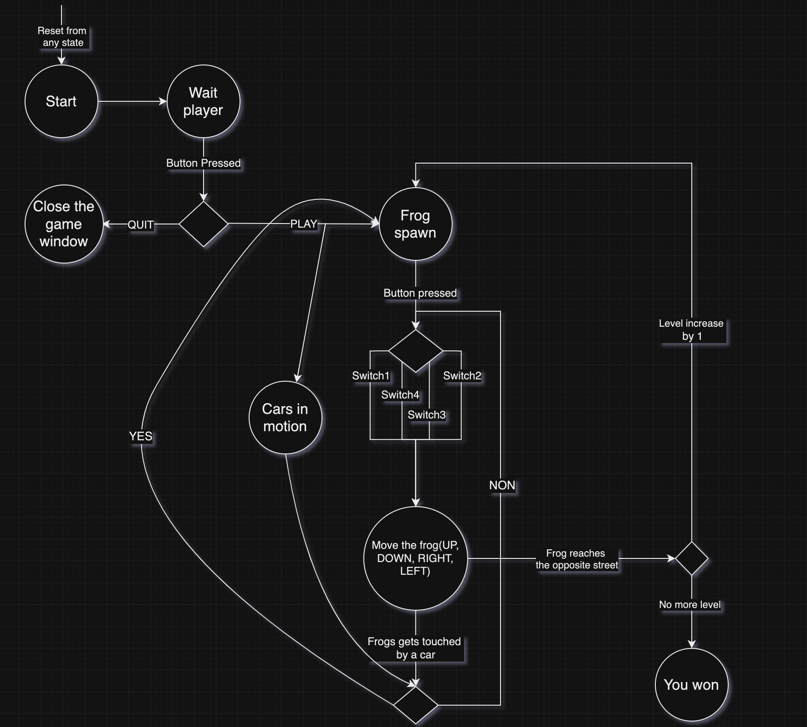

## III. Project Requirements:

### 1. FPGA notions.

In order to carry out the project successfully, here are the primordial notions you must master, and know when and where to use each of them.

#### a. Binary:

Binary, the base-2 number system, is fundamental to all digital systems, including FPGA-based designs. It forms the backbone of how data is represented and processed inside an FPGA. For this project, an understanding of binary is crucial for several reasons, which directly impact how the game logic, input handling, and display output are implemented.

Here’s how binary understanding plays a pivotal role in the project.

- **Digital Logic and Data Representation:**
At the core of any FPGA, all data is processed in binary format. Binary uses only two states: 0 and 1, which correspond to low and high voltage levels in the FPGA's circuitry. Every signal, whether it's controlling the movement of the frog, managing the level progression, or detecting collisions, is represented as binary data.

  - **Frog’s Position:** The frog’s position on the screen is represented as a binary number, encoding its X and Y coordinates in the game grid.

  - **Car Movement:** Each car on the road can be controlled using binary counters or shift registers, moving the cars from one end of the screen to the other.

  - **Switches and Inputs:** The player's inputs from the switches (up, down, left, right) are read as binary values (1 for pressed, 0 for unpressed). These values control the game logic, determining how the frog moves.

- **Finite State Machines (FSM):**
In digital systems like the Frogger game, finite state machines (FSMs) are used to control the game's flow, such as starting, playing, pausing, or resetting the game. Each state of the FSM is represented using binary encoding.

  - **Game States:** 
The game could have multiple states (e.g., Start, Play, Collision, Game Over). These states are encoded in binary, allowing the FPGA to transition between them efficiently.

  - **Binary State Representation:** For instance, you represent four states as:
    - 00: Start
    - 01: Play
    - 10: Collision
    - 11: Game Over This binary encoding allows you to quickly compare and transition between states.

- **Seven-Segment Display Control:**
In the Frogger game, the level number is displayed on two seven-segment displays. These displays require binary inputs to control which segments are turned on and off to show the correct number.

  - **Binary to Segment Mapping:** Each digit (0-9) on the seven-segment display corresponds to a unique binary pattern. For example, to display the digit "1", a specific combination of segments is illuminated, which is controlled by binary values.

The FPGA will store the binary-encoded level number and then translate this into signals to light up the correct segments on the display.

The following examples show how to capture all possible inputs, from 0000 to 1111(from 0 to F, for hexadecimal, from 0 to 15 for decimal) and translate each number into the correct pattern using the 7-bits, 7-bits as we have 7 segments.

    always @(posedge i_Clk)
      begin
        case (i_Binary_Num)
          4'b0000 : r_Hex_Encoding <= 7'b1111110; //0x7E
          4'b0001 : r_Hex_Encoding <= 7'b0110000; //0x30
          4'b0010 : r_Hex_Encoding <= 7'b1101101; //0x6D
          4'b0011 : r_Hex_Encoding <= 7'b1111001; //0x79
          4'b0100 : r_Hex_Encoding <= 7'b0110011; //0x33
          4'b0101 : r_Hex_Encoding <= 7'b1011011; //0x5B
          4'b0110 : r_Hex_Encoding <= 7'b1011111; //0x5F
          4'b0111 : r_Hex_Encoding <= 7'b1110000; //0x70
          4'b1000 : r_Hex_Encoding <= 7'b1111111; //0x7F
          4'b1001 : r_Hex_Encoding <= 7'b1111011; //0x7B
          4'b1010 : r_Hex_Encoding <= 7'b1110111; //0x77
          4'b1011 : r_Hex_Encoding <= 7'b0011111; //0x1F
          4'b1100 : r_Hex_Encoding <= 7'b1001110; //0x4E
          4'b1101 : r_Hex_Encoding <= 7'b0111101; //0x3D
          4'b1110 : r_Hex_Encoding <= 7'b1001111; //0x4F
          4'b1111 : r_Hex_Encoding <= 7'b1000111; //0x47
          default : r_Hex_Encoding <= 7'b0000000; //0x00
        endcase
      end

- **Collision Detection Logic:**
Collision detection between the frog and cars on the road is based on comparing binary values. The positions of the frog and cars are continuously checked to see if they overlap.

  - **Binary Comparisons:** Checking for collisions is done by comparing the binary values representing the X and Y positions of the frog and the cars. If the binary value of the frog's position matches that of a car’s position, the FPGA registers a collision, and the game resets.

- **Speed Control and Level Progression:**
As the level increases in your game, the cars' speed will increase. This can be controlled using binary counters inside the FPGA. Each time the frog reaches the top of the screen, the level increases, which can be represented as a binary number.

  - **Binary Counters:** The FPGA uses binary counters to control the timing of car movement. The counter value determines how fast the cars move, and as the level progresses, the binary value controlling the speed is increased, resulting in faster movement.

#### b. Gate Operations:
Before starting the project, we have to get use with different gate operations and how do they function. It is mandatory to have deep knowledge on gate operation for this project.

- **AND GATE:**

  An AND gate is a logic gate whose output is high only when both inputs are high or 1 in binary mode.

  |Input A | Input B | Output |
  |--------|-------- |--------|
  |0       |0        |0       |
  |0       |1        |0       |
  |1       |0        |0       |
  |1       |1        |1       |

- **NAND GATE:**
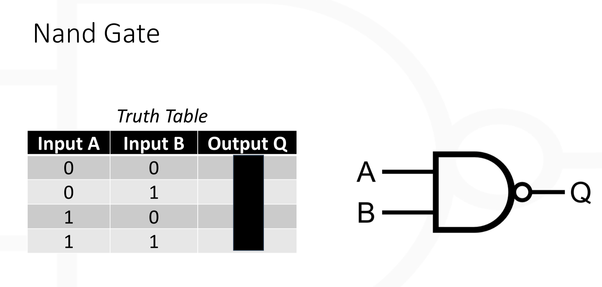

  The NAND gate is thus the same as the AND gate, but inverted. If both inputs are high, the output will be low.

  |Input A | Input B | Output |
  |--------|-------- |--------|
  |0       |0        |1       |
  |0       |1        |1       |
  |1       |0        |1       |
  |1       |1        |0       |

- **OR GATE:**
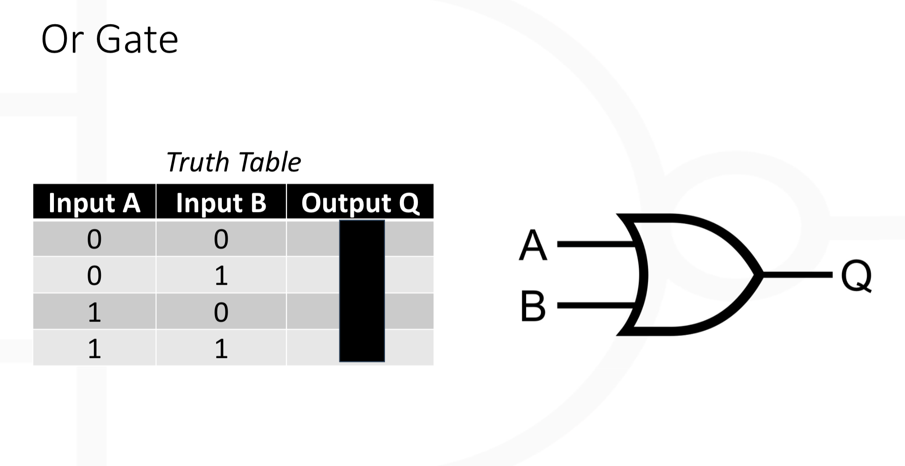

  The output of the OR gate is high when one of the input is high or when both inputs are high.

  |Input A | Input B | Output |
  |--------|-------- |--------|
  |0       |0        |0       |
  |0       |1        |1       |
  |1       |0        |1       |
  |1       |1        |1       |

- **XOR GATE:**
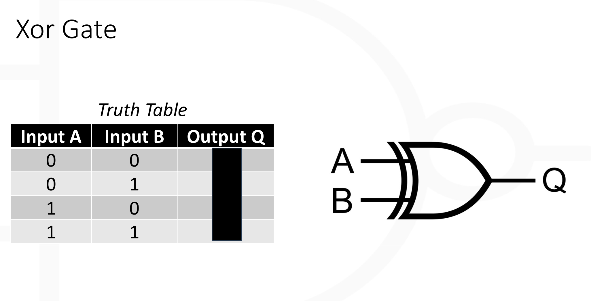

  The output of the XOR gate is high when either of the inputs is high, but not both.

  |Input A | Input B | Output |
  |--------|-------- |--------|
  |0       |0        |0       |
  |0       |1        |1       |
  |1       |0        |1       |
  |1       |1        |0       |

- **NOT GATE:**
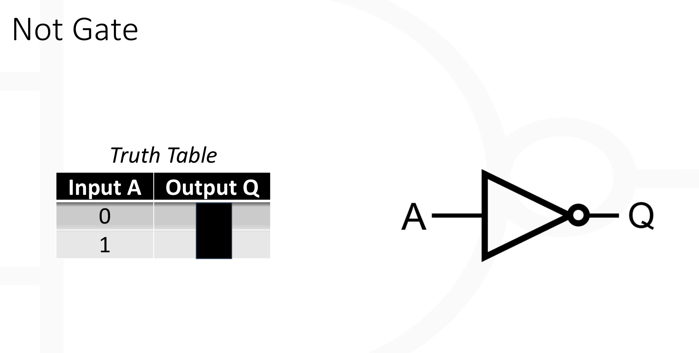

  The NOT gate has a single input and  a single output, and it's kind of invert, ie the output is ***not*** the input.

  | Input  | Output  |
  | ------ | ------- |
  |0       |1        |
  |1       |0        |

In the Frogger game project, logic gates are used extensively for:

- Input control to validate and execute frog movement.
- Collision detection by comparing binary positions of the frog and cars.
- State management for transitioning between different game states (Start, Play, Game Over).
- Display control to convert binary level data into signals for the seven-segment display.
- Speed control to adjust car movement timing based on the level.

By leveraging basic logic gates (AND, OR, NOT, XOR), we will design and implement the core functionality of the game in an efficient and reliable manner within the FPGA. This understanding is key to ensuring that your Verilog code correctly models the desired behavior of the game.

#### c. The Clock:
The clock signal in theFrogger game project is crucial because it provides the timing framework that synchronizes all operations. It controls the rate of movement for the frog and cars, manages input debouncing, drives the display refresh, and ensures collision detection happens in real-time. Without the clock, these critical operations would be unsynchronized, leading to erratic gameplay and inconsistent behavior.

In summary, the clock is necessary for:

- Synchronizing game logic and state transitions.
- Controlling the timing of movements for both the frog and the cars.
- Refreshing the display output consistently.
- Debouncing player inputs from switches.
- Managing level progression and adjusting the speed of gameplay.
- Ensuring real-time collision detection.

By understanding and utilizing the clock properly, the Frogger game will operate smoothly and in a synchronized manner on the FPGA platform.

#### d. LUT:
A Look-Up Table (LUT) is a fundamental component in Field-Programmable Gate Arrays (FPGAs) that plays a critical role in how logic functions are implemented. LUTs are used to map input combinations to corresponding output values based on predefined logic. In the Frogger game project, understanding LUTs is crucial because they define how Verilog code is translated into actual hardware behavior inside the FPGA.

Here’s an explanation of LUTs and their importance in the project:

- LUT is a small memory block that stores pre-calculated outputs for every possible combination of input values. Instead of computing the result of a logic function on-the-fly, the LUT stores all the possible outputs of a logic function and retrieves the correct output when given a specific input.

  - **Inputs and Outputs:**
A LUT can take multiple binary inputs (typically 4 to 6) and produce a single binary output based on a predefined truth table.
For example, a 4-input LUT can have 16 possible input combinations (2⁴), and it stores the corresponding output for each combination.

- In an FPGA, logic gates and functions such as AND, OR, XOR, NOT, NAND, are implemented using LUTs rather than physical gates. When you write Verilog code to describe your Frogger game (e.g frog movement, collision detection, level display), the FPGA’s synthesis tool translates the logic into a series of LUTs.

  - **Efficient Logic Implementation:**
    - Instead of constructing logic functions using individual gates like in traditional digital circuits, FPGAs use LUTs to store the results of those functions. This makes logic processing much faster and more efficient.

    - For instance, a simple function like Y = A AND B can be stored in a 2-input LUT, where the table contains all possible input combinations of A and B and the corresponding outputs.

  - For example: For an AND gate with two inputs, the LUT stores the output of the operation.
When the inputs are A=1 and B=1, the LUT quickly looks up the result (1) without performing any real-time computation.

#### Why Understanding LUTs is Essential

- **Efficient Logic Synthesis:** LUTs allow you to implement complex logic functions (e.g., frog movement, collision detection) efficiently in the FPGA without needing to physically construct each logic gate.

- **Fast Decision Making:** Since LUTs store precomputed results, the FPGA can quickly retrieve the output without having to recompute the logic, ensuring real-time performance in the game.

- **Optimizing Resource Usage:** The FPGA’s synthesis tool optimizes how LUTs are used, minimizing the number of logic resources required. This is important for fitting all the game logic into the limited hardware resources of the NANDLAND Go Board.

- **Simplified Design Process:** LUTs abstract the complexity of designing logic circuits manually, allowing you to focus on higher-level game functionality in Verilog.

In the Frogger game project, LUTs are crucial components of the FPGA, enabling efficient implementation of the game’s logic. From frog movement to collision detection, and from state management to displaying levels, LUTs handle the core operations by storing precomputed logic functions. Understanding how LUTs work and their role in FPGA programming is essential for developing an optimized and responsive game. This helps the FPGA run the game smoothly by minimizing computation time and efficiently using hardware resources.

#### e. Flip-flop:
// Flipflop image
A flip-flop is a fundamental memory element in digital circuits that stores a single bit of data (either 0 or 1) and is essential for implementing sequential logic in FPGAs. Unlike combinational logic (which depends only on current inputs), sequential logic requires storing past states and updating them based on a clock signal. Flip-flops help in this process by storing data from one clock cycle to the next.

In the Frogger game project, flip-flops will be used for several crucial tasks, including storing the current state of the game, tracking the frog’s position, and keeping time for movement updates.

On the image below we can see **D, En, >, and Q**. This simply shows that the flip-flop has 3 on the left inputs and 1 output on the right.
- The top left input **D** is the data input of the flip-flop, ie it is either 1 or 0 in binary format.
- The bottom left input **>** is the clock input, helps to synchronize the performance of the flip-flop. It triggers and take data from the data input (D), at regular time intervals, then pass it to **Q**, which is the output.
- The middle left input **En** is the clock enable, when the clock enable is high or 1, the clock triggers the flip-flop to update its output, but when the clock enable is low or 0, the clock doesn't triggers the flip-flop.

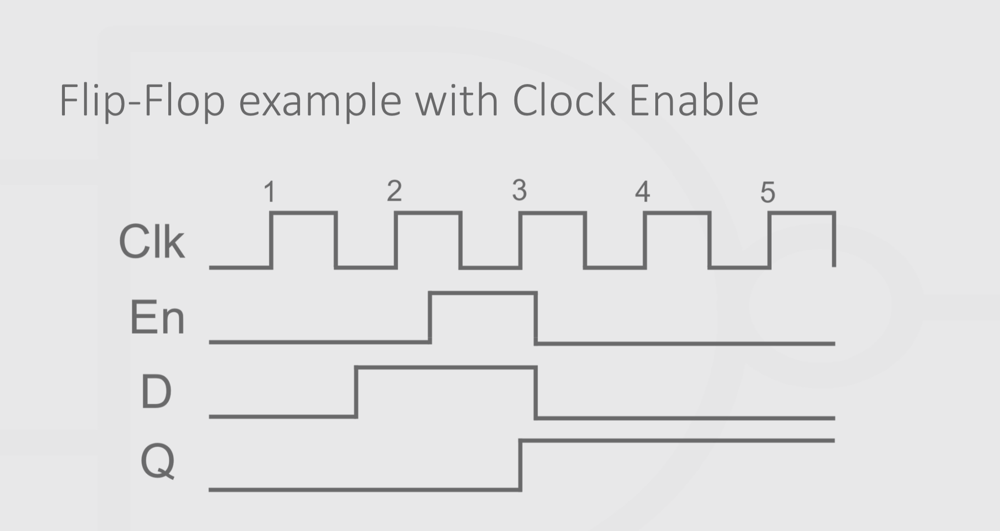

In the Frogger game project, flip-flops are crucial elements used to store and update game state information such as the frog’s position, current game level, and FSM state. They ensure that changes to the game’s state happen synchronously with the clock, providing smooth, real-time gameplay. Flip-flops are also used for timing circuits that control movement speed and debouncing circuits that handle player inputs. Without flip-flops, it would be impossible to implement the sequential logic necessary to make the game function properly on the FPGA.

- **Memory Elements for Sequential Logic:** Flip-flops store the data that defines the current state of various game elements (frog position, level, state of the game). This is essential for making the game responsive to both player inputs and game events.

- **Synchronized Updates:** Since flip-flops change state only on a clock edge, they ensure that the game operates in a synchronized manner, with updates occurring at consistent intervals.

- **State Transitions:** The flip-flops used in the FSM(Finite State Machine) control how the game transitions between different states (e.g., from "Play" to "Game Over").

- **Timers and Counters:** Flip-flops are used in timing circuits, such as the one that controls car speed. They help count clock cycles to regulate movement and gameplay events.

- **Debounced Input Signals:** Flip-flops are essential for stabilizing player inputs and ensuring that movement occurs correctly when switches are pressed.

### 2. Gameplay Requirements.

#### a. Player Movement:
The player movement in the Frogger game will be controlled using the four switches on the Nandland Go Board. Each switch corresponds to a specific direction, and pressing a switch will move the frog accordingly. Below, we will explain the Verilog code for implementing this functionality and discuss the roles of the clock, lookup tables (LUTs), flip-flops, and logic gates in this context.

- **Switch Control Overview:**
  - **Switch 1 (SW1):** Moves the frog left.
  - **Switch 2 (SW2):** Moves the frog down.
  - **Switch 3 (SW3):** Moves the frog up.
  - **Switch 4 (SW4):** Moves the frog right.

  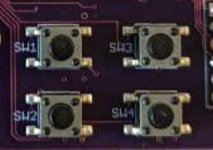

- **Verilog Code Implementation:**
The frog's position will be represented by two registers, **x_position** and **y_position**, which will be updated based on the state of the switches. The movement speed is defined by a parameter called **MOVE_SPEED**, which determines how many pixels the frog moves with each switch press.

        // Registers to store frog's current position
        reg [9:0] x_position;  // 10-bit register for x-coordinate (0-639 for 640 pixels)
        reg [9:0] y_position;  // 10-bit register for y-coordinate (0-479 for 480 pixels)

        // Movement speed (in pixels)
        parameter MOVE_SPEED = 10; // Speed of movement

        // Input: switch signals (active high)
        input wire SW1, SW2, SW3, SW4; // Switches for movement

        // Clock signal for synchronous logic
        input wire clk;

        // Always block to handle frog movement
        always @(posedge clk) 
          begin
            // Fog movement logic
          end
        end

    **NB:** The frog should start at the following coordinates on the screen
    - x-coordinate = 320
    - y-coordinate = 480

- **Explanation of Components Involved**
  - **Clock:**
 In the code, the always @(posedge clk) statement indicates that the logic inside the block executes on the rising edge of the clock signal.
 This means the frog’s position is updated only once per clock cycle, ensuring predictable and orderly movement.

  - **Lookup Tables (LUTs):**
FPGAs use LUTs to implement combinational logic functions. In this case, the logic for detecting switch presses will be implemented in LUTs.
The states of the switches are inputs to the LUTs, which will determine the output signals for moving the frog. LUTs can evaluate the conditions for movement and provide the necessary control signals to update the frog’s position based on the switch inputs.

  - **Flip-Flops:**
Flip-flops are used to store the current state of the frog's position (x_position and y_position). Each time the clock rises, the values of these registers are updated.
When a switch is pressed, the flip-flops store the new position of the frog. Without flip-flops, the position would not be retained across clock cycles.

  - **Logic Gates:**
Basic logic gates (AND, OR, NOT) are used to implement the logic that controls movement. For instance, when a switch is pressed, the corresponding logic gate will detect the input and enable the movement condition.
For example, the condition to move up can be described as:
    if (**SW1 AND y_position > 0**) using an AND gate to ensure both conditions are true before executing the movement.

- **Movement Speed Control:** The parameter MOVE_SPEED controls how far the frog moves with each switch press. We will adjust this parameter to make the movement we need, depending on gameplay requirements. The frog will move 32 pixels instead of 10, this will be change during the development phase. 

- **Debouncing Switches:**
Switches can produce noise when pressed (known as bouncing), which may cause multiple signals to be registered. To ensure that only a single clean signal is read when a switch is pressed, a debouncing mechanism using flip-flops can be implemented.

#### b. Obstacle Movement:
In the Frogger game, the movement of cars is automatic and will alternate between left-to-right and right-to-left across multiple roads (lanes). There are 10 horizontal roads, and on each road, cars will move at different speeds. As the player advances through levels, the speed of the cars will increase. There will always be up to 16 cars on the screen, distributed across the roads, and each car occupies one grid (32x32 pixels). Below, I’ll explain how the movement will be implemented, including speed control, direction, and reset behavior.

- **Screen and Grid Layout:**
  - The screen resolution is 640x480 pixels.
  - Each grid is 32x32 pixels, meaning that horizontally there are 20 grids (640 ÷ 32), and vertically there are 15 grids (480 ÷ 32).
  - Cars will move horizontally, either from left to right or right to left, and will occupy one grid space (32x32 pixels).
  - A total of 10 roads will have cars moving in alternating directions.

- **Verilog Code Structure**
The cars' positions will be stored in registers, similar to the frog’s position. Each car will have an x_position (horizontal) and a fixed y_position (vertical) corresponding to the road it's on. The speed of each car will be controlled by a parameter that increases with the game level.

      // Car position registers
      reg [9:0] car_x_position[15:0];  // 16 cars, each with a 10-bit x-coordinate
      reg [9:0] car_y_position[15:0];  // Fixed y-coordinate (road lanes)

      parameter CAR_SPEED = 3; // Base speed of cars in pixels per cycle (can increase with levels)

      // Clock signal
      input wire clk;

- **Cars Moving Automatically:**
In this section, we will explain how to implement the speed of the cars in the Frogger game. The cars will move at different speeds across the screen, and their speed will increase as the player advances to higher levels. We will go through the following steps:

    - Assigning speed values to cars
    - Controlling the car speed using the FPGA clock and clock divider
    - Increasing speed with each level
    - Resetting and repositioning cars when they move off-screen

  **i. Assign a Speed Value to Each Car:**
Each car needs its own speed value. We can achieve this by creating a register for each car that holds its speed. The speed will determine how many pixels the car moves per update cycle. For example:

    - Car 1 might move 2 pixels every update.
    - Car 2 might move 4 pixels every update.

  We store these speed values in an array, where each element corresponds to a car. This allows us to easily refer to each car’s individual speed during movement calculations.

  When a new level starts, these speed values will be initialized to default values, and as the game progresses, they will increase.

  **ii. Controlling Speed Using a Clock Divider (25 MHz Clock):**
At 25 MHz, each clock cycle takes 40 nanoseconds. To make cars move at a more reasonable speed (e.g., 2–10 pixels per second), we’ll need to divide the clock so that position updates happen much less frequently.

  - **Purpose:** Slow down the clock signal so that car position updates occur at a human-observable pace.
    - The 25 MHz clock is divided by 1,000,000, meaning the cars' positions will be updated roughly every 40 ms (25 MHz clock has a period of 40 ns, so 1,000,000 * 40 ns = 40 ms).
    - By adjusting the clock divider threshold (here 1_000_000), we can control how often the cars are moved, effectively changing their speed.
    - This delay will allow for smooth, human-observable car movements at the required speed.

  **iii. Increasing Speed with Each Level:**
As the player progresses through levels, the speed of all cars must increase to make the game more difficult. This can be achieved by incrementing the array that contains the speed of all the cars when a level is completed.

  - When the player completes a level, the level_up_signal triggers, and the speed of all cars is incremented by 1.
  - This ensures that with each new level, cars move faster, increasing the difficulty.

  **iv. Resetting and Repositioning Cars When Off-Screen:**
When a car moves off the screen (either to the right or left), it should reappear on the opposite side to create a continuous flow of obstacles. This is done by checking the car’s x_position and resetting it if it moves out of bounds.
  - The car's position is monitored continuously. If a car exceeds the screen boundary (e.g., x_position > 640 for cars moving left to right), it is reset to the opposite side (e.g., x_position = 0).
  - This ensures that the game always has cars moving across the screen without interruptions.

#### c. Levels of Difficulty:
The difficulty levels in the Frogger game are directly tied to how fast the cars move across the screen. As the player progresses through each level, the speed of the cars increases, making it more challenging for the player to avoid them. Additionally, each time the player successfully reaches the top of the screen, the game advances to the next level.

- **Tracking the Current Level:**
A **level counter** will be used to keep track of which level the player is on. This counter is incremented each time the player successfully reaches the other side of the road.
  - Initialize a register that stores the current level. It gets incremented whenever the level_up_signal is triggered (this signal will be activated when the player successfully reaches the top of the screen).

- **Increasing Car Speed as Levels Increase:**
As the player progresses through levels, the speed of the cars will increase, making the game more difficult. This is done by incrementing the speed values in the array each time a level is completed.
  - When the player advances to a new level (detected by level_up_signal), the speed of all cars is increased.
  - The new speed for each car is calculated by adding the current_level value to its base speed. This ensures that cars get progressively faster as levels increase.
  - For example, if Car 1 has a base speed of 2 pixels per update and the player is on Level 3, Car 1 will now move at 2 + 3 = 5 pixels per update.

- **Displaying the Current Level on the Seven-Segment Display:**
To provide visual feedback to the player, the current level will be displayed on the two seven-segment displays available on the Go Board. This helps the player know which level they’re on.
  - A seven-segment display module will take the current_level value as input and convert it into the corresponding 7-segment pattern for display.
  - The two seven-segment displays can show up to two digits, which is sufficient for levels 00 to 99.

    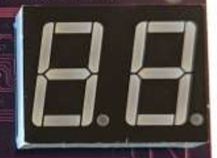

- **Level Cap**
To ensure the game doesn’t become too difficult too quickly, implement a cap on the maximum speed, so that when the difficulty reaches a particular level, the game has a constant max speed making it challenging but not unplayable.

### 3. Display Requirements
#### a. VGA Display:
The VGA (Video Graphics Array) display is used to visually present the game environment on a monitor. This includes showing the player’s frog, moving cars, the roads, and the game’s user interface (e.g., levels, messages like "PLAY" or "Game Over", "QUIT"). Understanding and implementing the VGA display is crucial for creating the interactive environment of the game. Here’s a detailed breakdown of how the VGA display will be implemented.

- **VGA Signal Basics:**

  The VGA signal operates on five main lines:

  - Red (R), Green (G), Blue (B): These control the intensity of the red, green, and blue colors for each pixel on the screen.
  - Horizontal Sync (HSYNC): Signals the beginning of a new row of pixels (horizontal refresh).
  - Vertical Sync (VSYNC): Signals the beginning of a new frame or image (vertical refresh).

  The VGA display in your project will have a resolution of 640 x 480 pixels (also known as VGA standard resolution). Each frame displayed will consist of:

  - 640 horizontal pixels.
  - 480 vertical pixels.

  **Pixel Grids:**
    - Each game element (frog, car, road) will be displayed on this 640 x 480 grid.
    - The frog, cars, and other elements will occupy a space of 32 x 32 pixels per grid cell.

- **VGA Timing and Synchronization:**

  VGA requires precise timing to control the display. The monitor relies on HSYNC and VSYNC signals to know when to start drawing a new row of pixels (horizontal) and when to begin a new frame (vertical).

    - **Horizontal Synchronization (HSYNC):** This indicates when to begin drawing a new row. After drawing 640 pixels in one row, the HSYNC signal triggers the display to move to the next row.

      - **Visible Area:** 640 pixels.

      - **Horizontal Front Porch:** The time between the end of the visible row and the HSYNC signal.

      - **Horizontal Sync Pulse:** The HSYNC signal itself.

      - **Horizontal Back Porch:** Time after the HSYNC signal before the next row begins.

  - **Vertical Synchronization (VSYNC):** After all 480 rows are drawn, the VSYNC signal is triggered, which resets the drawing process for the next frame.

    - **Visible Area:** 480 pixels.

    - Vertical Front Porch, Vertical Sync Pulse, and Vertical Back Porch are similar in function to horizontal timing but apply to rows instead of columns.
- **Displaying Game Elements (Cars, Frog, Roads):**

  The display logic involves determining which pixel on the screen corresponds to which game object (frog, cars, roads, etc.). The screen grid of 640 x 480 pixels will be divided into smaller 32 x 32 pixel cells, representing the frog, cars, and other obstacles.

  - **Displaying the Frog and Cars:**

    - **Frog Position:**
      - The frog will occupy one 32x32 grid cell on the screen, and its position is updated based on the player’s input (controlled by switches).
    - **Car Movement:**
      - Cars will also occupy 32x32 grid cells and will move horizontally across the screen. The speed of the cars will be adjusted dynamically based on the game level.

      - Each time a frame is drawn, the positions of the frog and cars will be updated according to their movement speed.
  - **Background and Road Display:**
    The road can be displayed as a continuous black section across the screen, where the cars move.

  The VGA display implementation involves creating a precise timing controller to manage the HSYNC and VSYNC signals and sending pixel data (color values) to the display for each frame. The game elements like the frog, cars, and roads are rendered on the screen by mapping their positions to pixel locations within the 640x480 grid.

#### b. Sprite Graphics:
- **Cars sprite**

  The cars represent moving obstacles in the game that the player must avoid. 

  Each grid is 32 x 32, we have a 20 x 15, that is, 20 grid for the x-coordinate and 15 grid for the y-coordinate.
    - Cars with roads numbers (2, 4, 7, 10, and 12) on the 15 y-coordinate, move from left to right.
    - Cars with roads numbers (3, 5, 8, 11, and 14) on the 15 y-coordinate, move from right to left.
    - When a car moves off the screen (past 640 pixels or before 0 pixels), it resets to the opposite side to create a continuous loop.
    - The width of each car can vary (depending on car type), but the height will always be 32 pixels.

  The cars will be displayed in various colors to create variety:
    - **Red Car:**
      - Red (R): 255
      - Green (G): 0
      - Blue (B): 0

    - **Blue Car:**
      - Red (R): 0
      - Green (G): 0
      - Blue (B): 255
 

- **Frog Sprite**

  The frog is the main player character in the game, and it will be controlled by the player using the switches on the FPGA board.

  - **Pixel Size:**
    - The frog will be represented as a 32 x 32 pixel square on the 640x480 VGA screen.
  - **Color:**
  The frog will be drawn in green to distinguish it from the background and obstacles.
    - Red (R): 0
    - Green (G): 255
    - Blue (B): 0
  - **Positioning:**
    - The initial position of the frog will be at the center bottom of the screen (on the road).
    - The position will be updated based on player input (using switches) to move the frog up, down, left, or right.

  

- **Road sprite**

  The road is where the cars move, and the frog has to cross it to reach the other side. It will occupy a portion of the screen, specifically in the lower half of the VGA display.

    - **Pixel Size:**
      - The road will span the entire width of the screen (640 pixels) and will be broken into lanes, and pedestrian crossing.
      - Each lane will be 2 pixels in height.
      - On the first, sixth, ninth, fourteenth, and fifteenth row on the screen, will be the pedestrian crossing, these are places where the frog is save from cars traffic.
    - **Number of Lanes:**
      - There will be a total of 7 lanes, each 2 pixels tall. Cars will move on these lanes, alternating in direction.
    - **Color:**
      The road will be displayed in black to contrast with the cars and the frog.
      - Red (R): 0
      - Green (G): 0
      - Blue (B): 0
  
    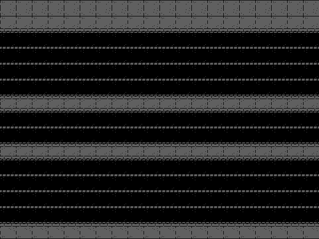

    In the image above, the dark areas represent spaces where cars move and where the frog can also travel. The grey areas are safe zones, where the frog cannot be touched by any car.

- **Lane Dividers**
  To visually differentiate the lanes where cars move, you may add lane dividers.

    - **Pixel Size:**
      - The lane dividers will be represented as 2-pixel horizontal lines.
      - These dividers will be drawn between the lanes on the road.
    - **Color:**
      Lane dividers can be drawn in grey to contrast against the black road:
      - Red (R):128
      - Green (G): 128
      - Blue (B): 128

- **Game Background**
  The background is the general area outside of the road. It can be drawn in a contrasting color like blue or green to differentiate it from the road.

  - **Pixel Size:**
    - The background will cover the entire screen (640 x 480 pixels), except for the road area.
  - **Color:**
    The background is represented in black:
    - Red (R): 0
    - Green (G): 0
    - Blue (B): 0

- **Displaying the Frog, Cars, and Road Together:**
By managing the VGA timing and the pixel drawing logic, the frog, cars, road, and background will be drawn on the screen. The positions of the frog and cars will be updated continuously to reflect their movements, and the game’s visual elements will be displayed in real-time.

### 4. Debouncing Logic:
The player's movements are controlled by physical switches, debouncing is essential to ensure that the system correctly interprets the player's inputs. Without debouncing, the mechanical nature of switches can cause multiple, unintended signals to be generated from a single press, resulting in erroneous frog movements.

When a mechanical switch is pressed, it does not transition cleanly from an "off" state to an "on" state. Instead, it can make and break contact several times before settling. This phenomenon, known as "bouncing," can last for a few milliseconds and cause the FPGA to detect multiple presses, even though the switch was only pressed once.

In the Frogger game, this would lead to undesired behavior such as the frog moving multiple steps when the player intended to move only once.

To prevent this, debouncing logic is required to filter out these unintended signals. There are different ways to debounce, but the most common method in FPGA is using a counter-based debouncing mechanism. Here’s how it can be done:

#### a. Steps for Implementing Debouncing
- **Input Sampling:**

  - Continuously monitor the switch inputs and check their states at regular intervals (based on the system clock).

- **Stabilization Period:**

  - Use a counter to wait for the input to remain stable (pressed or unpressed) for a certain period of time. This ensures that the switch is no longer bouncing.

- **Debounced Output:**

  - After the input has remained stable for the specified time, register the input as valid and output it to the game logic.

- **Debouncing Implementation Logic:**

  To debounce the switches, we’ll use a simple counter and flip-flops to store the stable state of each switch.

    - **Clock:** The system clock (25 MHz) will be used to time the debouncing interval.

    - **Stable Duration:** We'll have a debounce time of 20 ms (typical for mechanical switches). At 25 MHz, this equates to 500 clock cycles.

    - **Counter:** Counts up to 500 clock cycles (20 ms) after detecting a change in the switch state.

    - **Stable State:** If the switch input remains stable (either pressed or released) for the full duration of the counter, we register the change.

    - **Output:** Only when the switch is stable for 20 ms, the debounced switch output is updated, ensuring that no false presses are detected.

#### b. Applying Debouncing in Frogger Game:
Each switch controlling the frog’s movement will need to pass through this debouncing module before being processed by the game logic. This ensures that the frog moves exactly as intended by the player and avoids unintended movements caused by switch bouncing.

- **Switches for Movement:**
  - SW1 (Move right), SW2 (Move down), SW3 (Move up), and SW4 (Move right) will all go through debouncing before controlling the frog's position on the screen.

  - Once debounced, the stable switch state will trigger the movement logic (e.g., incrementing or decrementing the frog’s x or y coordinates).

### 5. Game States
#### a. Initialization:
The initialization of the game state is a critical part of the Frogger game design. It sets the foundation for gameplay by resetting the player's level, and other essential variables before the game begins. This ensures that every time the game starts, either after a reset, the game starts in a known, default state.

Here's how the initialization state can be designed and implemented for the technical document.

- **Purpose of Initialization:**
  - Level initialization

  - Positioning the frog at the starting position on the screen.
  
  - Setting all game elements, like cars and other obstacles, to their initial positions.
  
  - Ensuring that the VGA display starts with the correct graphics.
  
  - Setting the game state machine to "start" the game, waiting for the player to press the "PLAY" button.

- **Game Initialization Steps:**
  - **Resetting Level:**
    At the beginning of the game, the player's level will start at 1. The level will only increase as the player succeed in crossing the road and reaching the opposite pedestrian crossing. In the initialization state, you set the segments to 01:
  - **Positioning the Frog:**
    The frog will be placed at the starting position (bottom center of the screen) every time the game starts or resets.
  - **Initializing Obstacles (Cars):**
    Each car will also need to start at a predefined position. Since the cars are moving objects, their initial positions will be reset when the game is initialized. Cars may spawn off-screen and move horizontally in their lanes.
  - **VGA Display Initialization:**
    The VGA display must be initialized to show the game background (e.g., roads and lanes). We will also need to display the starting menu ("PLAY" or "QUIT") or show the initial game state.

    - Initialize the VGA display module with the correct colors for each game element (frog, cars, road, background) based on their pixel coordinates.
- **Game State Machine:**
The game will be controlled by a state machine, with Initialization as the first state. Once everything is initialized (levels, positions), the game transitions to the Waiting for Play state, where the player can press the play button to start.

#### b. Playing:
The Playing state in your Frogger game defines the core mechanics of the game during active gameplay. In this state, the frog moves according to the player's inputs, cars move automatically across the screen, and the game constantly checks for collisions between the frog and cars. It also handles scoring and updating the game level when the frog successfully crosses the road.

- **Movement:**
  - **Frog Movement:**
  The player controls the frog using four switches (SW1, SW2, SW3, and SW4) on the FPGA Go Board, which map to movements in four directions: up, down, left, and right. Each switch press moves the frog by one grid space (32x32 pixels).

  -  **Car Movement:**
  Cars move automatically across the screen at different speeds, with some moving left to right and others right to left. Each car has an x coordinate that updates according to its speed. When a car moves off the screen, it reappears on the opposite side.

  - **Collisions:**
  Collision detection is essential in the Playing state to determine whether the frog has been hit by a car. If a collision is detected, the player the game resets or restarts.

    - **Collision Detection Logic:**
    Collision detection checks whether the frog's x and y coordinates overlap with any of the cars' x and y coordinates. Since the frog and cars are represented as grid-aligned objects (32x32 pixels), checking collisions involves comparing the positions of the frog and the cars on the screen.

    - **Bounding Box Collision:** A simple way to check if the frog has collided with a car is to compare the bounding boxes of the frog and the car.
    - **Reaction to Collision:** When a collision is detected, the game transitions to Game Over state and resets the frog to the starting position.

#### c. Game Over or Level Completion
The Game Over is triggered by a collision between the frog and a car. Since there are no lives, the game immediately ends when the frog gets hit by a car.
- **Collision Detection and Reset:**
  - The game continuously checks for collisions between the frog and the cars. When a collision is detected, the game transitions to the Game Over state.

  - Reset Behavior on Collision: When a collision occurs, the frog’s position remains where the collision happened until the game either restarts or goes to the Game Over screen.

- **Game Over Trigger:**
When a collision is detected, the game transitions to the Game Over state. This involves displaying a "Game Over" message on the screen and making the frog to spawn back to its initial state.

- **Resetting the Game:**
After the game enters the Game Over state, the game reset automatically. This action resets all game parameters, including the level and the frog's position.

  - **Reset Conditions:**
  To restart the game, the player presses SW1 and SW2. This action resets:
    - **Level:** Reset to Level 1.
    - **Frog Position:** Reset to the starting position at the bottom of the screen.
  - **Transitioning Back to Play:**
  Once Game Over, the game transitions back to the Playing state, starting the game from the beginning.

- **Level Completion Conditions:**
Level completion happens when the player successfully moves the frog across the road to the top of the screen without getting hit by a car.

  - **Reaching the Top:**
    - When the frog reaches the top of the screen (the y coordinate is 0), the game recognizes that the current level is complete. At this point, the level is incremented by 1.

    - The frog is reset to the starting position for the next level, and the game continues with the new level settings (e.g., faster car speeds).

  - **Difficulty Adjustment:**
  With each new level, the difficulty increases. The speed of the cars increases slightly, making the game more challenging.

  - **Level Limit:**
  The game can has a finite number of levels (with increasing speed), and the maximum level is 99.

### 6. Timing and Synchronization
In this project, timing and synchronization are critical to ensure that both the game logic and the VGA display function correctly and in harmony. The Nandland Go Board provides a 25 MHz clock by default, and this clock will be divided and managed to handle different aspects of the game, including game logic and VGA display.

- **FPGA Clock Division:**
The main clock signal from the FPGA is too fast for many of the game’s components, so we need to divide it down to lower frequencies for different purposes. In particular:

  - **VGA Output Timing (25 MHz):**

    - VGA monitors typically require a 25 MHz pixel clock for a resolution of 640 x 480 at a refresh rate of 60 Hz. We will use the 25 MHz system clock directly for VGA output timing.

    - This clock controls the pixel drawing rate, which is necessary for the VGA controller to correctly display each frame on the screen. Each pixel is displayed at a specific time, and the horizontal and vertical synchronization signals ensure that the screen is refreshed at the correct rate.

    - The 60 Hz refresh rate means that the entire screen is redrawn 60 times per second, ensuring smooth gameplay without flickering.

  - **Game Logic (Slower Clock):**

    - Game logic, such as player movement, car movement, and level progression, does not need to operate at 25 MHz. It is generally much slower because human players can't react that fast, and car movements need to be perceptible.

    - For these purposes, we will use a clock divider to generate a slower clock signal.

- **Timing for Game Logic Synchronization:**
  
  - Player and Car Movements:

    - Movements in the game (e.g., player movement, car speed) must be synchronized with the game clock. The slower clock derived from the main clock ensures that the game updates at a manageable speed for human input and perception.

    - As the level increases, car speeds also increase, which can be achieved by adjusting the frequency of updates for the car positions.

  - **Collision Detection:**

    - Collision detection between the frog and the cars must be evaluated at each game tick, typically synchronized with the slower game clock. This ensures that collisions are handled in real time during active gameplay.

### 7. Folder structure
The image below illustrates the project folder's structure, The Project root folder is the **main** branch on github. 

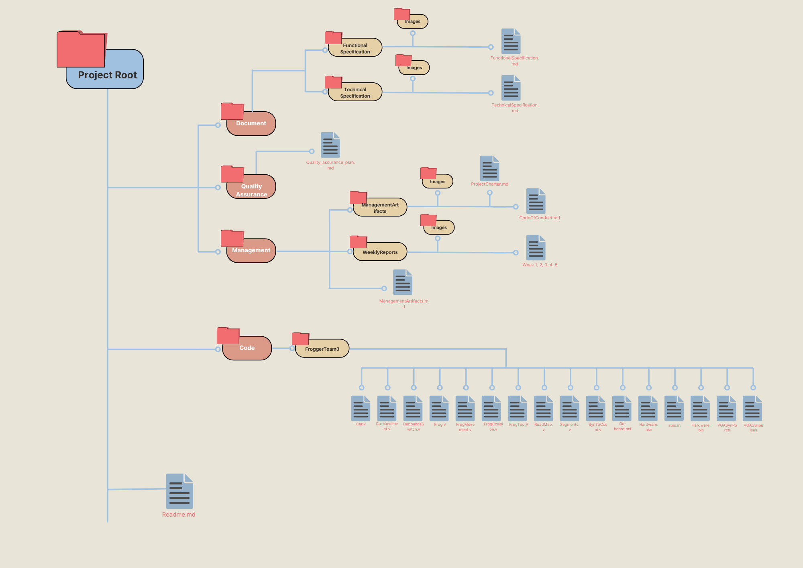

The image above illustrates how all the files, folders, and subfolders will be named.

## IV. Module Breakdown

### 1. Top-Level Module
The Top-Level Module is the Verilog module that integrates all the submodules, coordinating their functionality to create the full game. This module acts as the central hub, where all game inputs (switches), outputs (VGA, seven-segment displays), and internal signals (player position, obstacle movement, collision flags) interact.
* Inputs:
    * Switches for player control.
    * Reset signal to restart the game.
    * 25 MHz clock from the FPGA.
* Outputs:
    * VGA signals for displaying the game.
    * Level number shown on the seven-segment display.
* Internal Signals:
    * Player position and movement logic from the Player Control Module.
    * Obstacle positions from the Obstacle Generation Module.
    * Collision flags from the Collision Detection Module.
    * Game states handled by the Game Logic Module.
    * Clock signals from the Clock Divider Module.

This module will instantiate and connect all submodules, ensuring smooth communication between them. For example, it connects the player’s movement signals to the collision detection system and updates the VGA output accordingly.

### 2. Modules and Submodules files name.
Files name of the Frogger project.

`Frog.v`: **Module**

 This module defines the frog’s properties, including its size, position, and initial placement on the screen.

`FrogTop.v`: **Module**

FrogTop.v Top-Level Module
This module integrates the submodules related to the frog (such as FrogMovement and FrogCollision), combining them to control the frog’s behavior in the game.

`FrogMovement.v`: **submodule**

FrogMovement.v Submodule to control the frog’s movements, likely used inside the FrogTop.v (the top-level module that manages the frog). This isolates the movement logic, making it easier to manage.

`FrogCollision.v`: **submodule**

FrogCollision.v Submodule to detect collisions between the frog and other game elements like cars. It would be instantiated within FrogTop.v or another overarching module handling game logic.

`Car.v`: **Module**

Car.v Module This module likely defines the behavior and properties of the cars (obstacles) in the game, such as their size, position, and rendering on the VGA display.

`CarMovement.v`: **submodule**

These handles the specific task of moving cars across the screen. It would be instantiated inside a top-level car management module (such as Car.v).

`DebounceSwitch.v`: **submodule**

Handles debouncing logic for switch inputs. This would be a helper module that might be used inside the FrogMovement.v module to ensure smooth, error-free control inputs.

`SynToCount.v`: **submodule**

Likely a helper that synchronizes events and handles counting tasks, such as counting frames, levels, or timing, used inside various game-related modules for timing or level progression.

`VGASynPorch.v`: **submodule**

Handles the vertical and horizontal sync porch signals for the VGA output, which defines the timings for the display refresh.

`VGASynPulses.v`: **submodule**

Generates the horizontal and vertical sync pulses necessary for controlling the VGA output and ensuring the image is displayed correctly on the screen.

`RoadMap.v`: **Module**

Defines the visual layout and structure of the road, where the cars move and the frog navigates. It could also map specific areas as "safe zones" or "danger zones."

`Segments.v`: **Module**

Handles the seven-segment display, likely used to show the player’s current level or score.

`SGo-board.pcf`: **Pin Constraint File (Not a module)**

Specifies how the FPGA’s internal logic is connected to the external pins on the Go Board (e.g., VGA, switches, seven-segment display).

`Hardware.asc`: **Configuration File (Not a module)**

Likely an ASCII format file that describes the hardware configuration used in the project.

`apio.ini`: **Configuration File (Not a module)**

Apio configuration file, used for defining the project setup, toolchains, and project environment.

`hardware.json`: **Configuration File (Not a module)**

Contains hardware configuration details in JSON format, describing the board or FPGA setup.

`Hardware.bin`: **Binary File (Not a module)**

The compiled binary bitstream file that is loaded onto the FPGA to configure it based on your Verilog code.

## VII. Implementation Details

### 1. Finite State Machines (FSMs)
In the Frogger game, the FSM is responsible for managing the game’s different states, ensuring smooth transitions between the game's phases. The FSM controls key game stages, such as initialization, gameplay, level progression, and game over.

The FSM will operate based on a combination of player inputs (e.g., frog movement, collisions) and internal game events (e.g., reaching the top of the screen or completing a level). The state machine will also synchronize with the clock to ensure that the state transitions occur at the appropriate time intervals.

FSM States and Transitions
The FSM will have the following states:

#### a. IDLE
* **Purpose:** This is the default state where the game waits for the player to press "Start" to begin.

* **Conditions to Transition:** The FSM transitions to the INIT state when the player presses the "Start" button or the play switch.

* **Outputs:** The game display will show the start screen, and no game activity occurs in this state.

#### b. INIT (Initialization State)
* **Purpose:** This state initializes the game variables, such as resetting the score, positioning the frog at the starting position, setting level 1, and resetting the positions of the obstacles (cars).

* **Conditions to Transition:** Once initialization is complete, the FSM transitions to the PLAYING state.

* **Outputs:** Set the score to 0, reset the frog’s position to the bottom of the screen, and display "Level 1" on the seven-segment display.

#### c. PLAYING
  * **Purpose:** This is the main game state where the player can control the frog, and obstacles (cars) are moving on the screen. In this state, the FSM handles movement, collisions, and scoring.

  * **Conditions to Transition:**
      * If the frog reaches the top of the screen, the FSM transitions to the LEVEL_COMPLETE state.

      * If the frog collides with a car, the FSM transitions to the GAME_OVER state.
  * **Outputs:** Enable frog movement using the switches, move obstacles at their respective speeds, check for collisions, and update the score as the frog progresses.

#### d. LEVEL_COMPLETE
  * **Purpose:** This state occurs when the player successfully moves the frog to the top of the screen. It prepares the next level, where cars move faster.

  * **Conditions to Transition:** After increasing the level number and adjusting the speed of the obstacles, the FSM transitions back to the PLAYING state to start the next level.

  * **Outputs:** Increase the level number on the seven-segment display, reset the frog’s position to the starting point, and increment the speed of the obstacles.

#### e. GAME_OVER
  * **Purpose:** This state is triggered when the frog collides with a car. The game will reset from the beginning.

  * **Conditions to Transition:** The FSM automatically reset everything and the player restart a new game.

  * **Outputs:** Display "Game Over" on the screen, reset all game variables, to restart from the level 1.

#### f. Output Signals and Actions in Each State
Each state will trigger specific actions, such as initializing variables, moving the frog, or updating the display.

  * **IDLE**: Display the "Start" screen, wait for input.

  * **INIT**: Reset all variables, including score, level, and frog’s position.

  * **PLAYING**: Enable player control of the frog, move obstacles (cars), and check for collisions.

  * **LEVEL_COMPLETE**: Increase the level, reset the frog’s position, and adjust car speed.

  * **GAME_OVER**: Reset the game, display "Game Over" on the screen, and restart the game with the frog spawning at it initial position.

#### g.  Clock Synchronization and Timing

  * The FSM is clocked by the 25 MHz system clock, ensuring smooth transitions and timing. The state changes occur based on game events (e.g., frog reaching the top, collisions) and are synchronized to the game's clock, ensuring timing consistency across the game.

  * The VGA refresh rate (typically 60 Hz) is also tied into the FSM to ensure the game display updates consistently with the current state.

#### h. Conclusion
- This FSM design efficiently manages the game’s flow, responding to player inputs and in-game events to transition between states. Each state has clearly defined actions and transitions, ensuring smooth gameplay and a consistent experience across all levels of the game.

- This structure for the FSM can be implemented in Verilog and instantiated in the top-level module of the game to control the overall logic of the Frogger game.

## VIII. Testing and Validation
### 1. Testbench Design
To ensure each individual module in the Frogger game functions correctly, Verilog testbenches will be created and executed on EDAPlayground. The purpose of these testbenches is to simulate the behavior of each module in isolation, verify its functionality, and identify any potential issues before integrating the modules into the top-level design. 

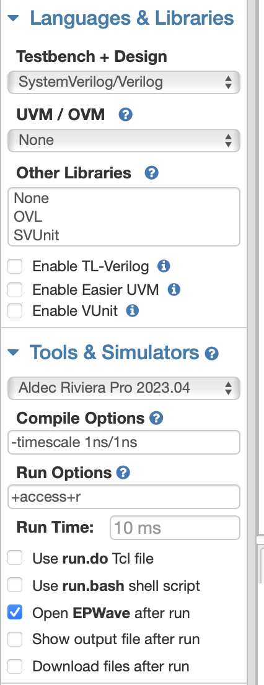

#### a. **Structure of a Testbench**

A Verilog testbench is a non-synthesizable module used to test another module. It does not represent physical hardware but serves as a simulation environment. It consists of four key components:

1. **Instantiation of the DUT (Device Under Test):** Each testbench will instantiate the module being tested, such as FrogMovement, CarMovement, or CollisionDetection. This involves connecting the testbench's inputs and outputs to the DUT’s ports.

2. **Clock Generation:** Most of your modules rely on the 25 MHz system clock for proper operation. The testbench will include a clock generator that simulates the system clock by toggling a signal every 20 nanoseconds (to replicate the 25 MHz frequency). This clock drives the game’s logic and the VGA display verilog

3. **Stimulus Definition:** The testbench will apply different input stimuli to simulate real-world conditions. For example:
    * In the PlayerControl testbench, inputs will simulate switch presses (SW1, SW2, etc.) to move the frog.

    * For the CarMovement testbench, inputs will simulate the initial car positions and update them over time to verify that cars move correctly in both directions.

	Stimulus generation will ensure that all edge cases are tested, such as rapid switch presses, simultaneous button presses, or the frog reaching the screen 		boundary.

4. **Response Monitoring and Assertions:** The testbench will continuously monitor the outputs of the DUT and compare them against the expected results. This involves writing checks to confirm correct output based on given inputs. If the output is incorrect, the testbench will trigger an assertion failure and log an error message. For example:

    * In the CollisionDetection testbench, after simulating a frog's position overlapping with a car, an assertion would check if the collision signal is triggered correctly.

#### b. **Modular Testing Approach**

For each functional unit, a dedicated testbench will be written:

* **Player Control Module:** Test the frog’s movement in all directions (up, down, left, right) and ensure boundary limits are respected.

* **Obstacle Generation Module:** Verify that cars appear at the correct positions, move at different speeds, and reset when they reach the screen edge.

* **Collision Detection Module:** Ensure that collisions between the frog and cars are accurately detected and the appropriate signal is triggered.

* **VGA Controller Module:** Simulate the timing signals for VGA output (sync pulses, pixel rendering) and verify that the screen refreshes properly.

#### c. Edge Case Testing
Each testbench will include edge cases to ensure robustness. For instance:

* In the FrogMovement testbench, what happens if multiple switches are pressed simultaneously?

* In the CollisionDetection testbench, is the collision detected correctly at all possible points of intersection?

#### d. Testbench Execution on EDAPlayground
Once a testbench is complete, it will be executed in EDAPlayground, where you can:

* **Simulate Waveforms:** By visualizing signal transitions (e.g., frog’s position, car positions, VGA sync pulses), you can ensure correct timing and synchronization of game elements.

* **Verify Logs and Outputs:** Simulation tools will produce logs that detail whether all assertions passed or failed, providing insight into where corrections may be needed.

This structured approach to designing testbenches will ensure that each module is verified thoroughly before being integrated into the larger system. By detecting and fixing issues early in simulation, you reduce debugging time during hardware testing and improve the reliability of the final design.

## IX. Conclusion

The purpose of this design is to implement a Frogger-style game on an FPGA using Verilog. The project aims to integrate player control, game logic, collision detection, and VGA display into a functional system that runs smoothly in real-time on the Nandland Go Board. The primary goals are to:

1. **Gameplay:** Ensure smooth, responsive gameplay where the player controls a frog navigating a series of roads with moving cars, aiming to reach the top of the screen.

2. **Display Quality:** Use a 640x480 VGA display to render the game, ensuring the frog, cars, and road are displayed with accurate pixel representation and proper colors.

3. **Performance:** Maintain smooth game execution and display rendering, with real-time responsiveness to player inputs and obstacles, even as the difficulty increases.

The expected outcome is a fully playable Frogger game with clear graphics, responsive controls, and a seamless increase in difficulty through level progression, all achieved on an FPGA.

## X. Glossary

1. **Binary:** A number system that uses only two digits, 0 and 1. It is the foundation of digital systems, where each digit represents a state (e.g., on or off).

2. **Gate Operations:** Basic logic operations performed by digital circuits, such as AND, OR, NOT, XOR, and NAND. These operations are fundamental to digital logic and are used to build more complex circuits.

3. **Clock:** A signal that oscillates between high and low states at a fixed frequency. It is used to synchronize the operations of digital circuits.

4. **LUT (Look-Up Table):** A small memory block in an FPGA that stores pre-calculated outputs for every possible combination of input values. LUTs are used to implement logic functions efficiently.

5. **Flip-Flop:** A fundamental memory element in digital circuits that stores a single bit of data (either 0 or 1). It is essential for implementing sequential logic in FPGAs.

6. **FPGA (Field-Programmable Gate Array):** A type of integrated circuit that allows users to configure and reconfigure its hardware logic to perform specific tasks after manufacturing.

7. **HDL (Hardware Description Language):** A language used to describe the behavior and structure of electronic systems, such as Verilog or VHDL.

8. **VGA (Video Graphics Array):** A standard for displaying graphics on a monitor. It uses a combination of red, green, and blue signals to control the color of each pixel on the screen.

9. **Sprite:** A small graphic that is part of a larger scene. In this context, the frog and cars are sprites.

10. **Debouncing:** A technique used to ensure that a switch or button press is registered correctly by filtering out unintended signals caused by mechanical bouncing.

11. **Finite State Machine (FSM):** A model of computation used to design digital circuits. It consists of a finite number of states, transitions between those states, and actions.

12. **Testbench:** A non-synthesizable Verilog module used to test another module. It does not represent physical hardware but serves as a simulation environment.

13. **EDAPlayground:** An online platform for simulating and testing Verilog and VHDL designs.
By making these corrections and adding the glossary, the document should be clearer and more accessible to a broader audience.

