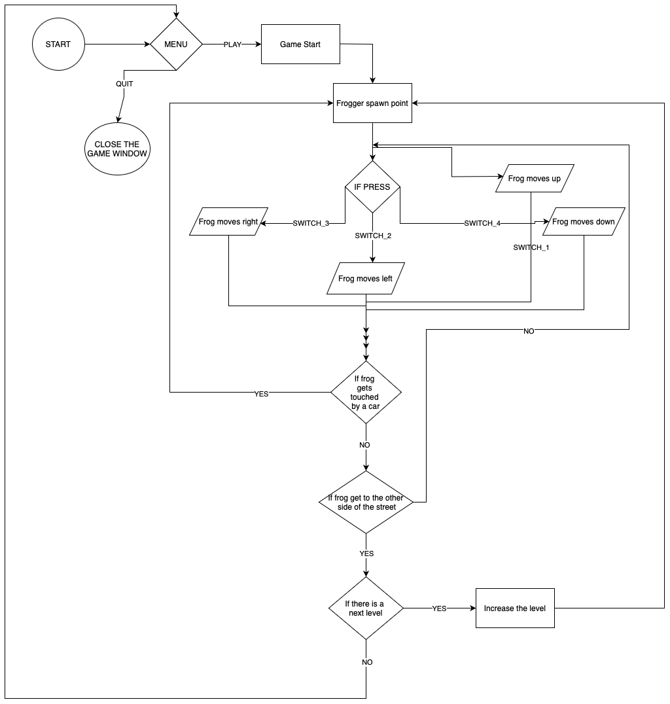

# Technical Specification for Frogger Game on FPGA (Verilog)

| Role | Name | Signature | Date |
| ---- | ---- | --------- | ---- |
| Project Manager    | Lucas Aubard             | ✅ | 09/26/2024 |
| Program Manager    | Julian Reine             | ✅ | 09/26/2024 |
| Tech Lead          | Tsangue Vivien Bistrel   | ✅ | 09/26/2024 |
| Software Developer | Manech Laguens           | ✅ | 09/26/2024 |
| Software Developer | Mariem Zayenne           | ✅ | 09/26/2024 |
| Quality Assurance  | Raphaël Chiocchi         | ✅ | 09/26/2024 |
| Technical Writer   | Abderrazaq Makran        | ✅ | 09/26/2024 |

## Table of Contents

- [Technical Specification for Frogger Game on FPGA (Verilog)](#technical-specification-for-frogger-game-on-fpga-verilog)
  - [Table of Contents](#table-of-contents)
  - [I. Introduction](#i-introduction)
    - [1. Project Brief](#1-project-brief)
    - [2. Overview](#2-overview)
    - [3. Game Specifications](#3-game-specifications)
    - [4. Objective](#4-objective)
    - [5. Requirements](#5-requirements)
    - [6. Hardware \& Software requirements](#6-hardware--software-requirements)
      - [a. Hardware](#a-hardware)
      - [b. Software](#b-software)
    - [7. Target Audience](#7-target-audience)
  - [II. System Overview](#ii-system-overview)
    - [1. System Architecture](#1-system-architecture)
    - [2. Hardware Specifications](#2-hardware-specifications)
    - [3. Software setting up Design](#3-software-setting-up-design)
      - [a. Setting up the software environment.](#a-setting-up-the-software-environment)
      - [b. Design](#b-design)
  - [III. Project Requirements](#iii-project-requirements)
    - [1. Gate Operations:](#1-gate-operations)
    - [2. The Clock:](#2-the-clock)
    - [3. LUT():](#3-lut)
    - [4. Flipflop:](#4-flipflop)
    - [5. Gameplay Requirements](#5-gameplay-requirements)
      - [a. Player Movement:](#a-player-movement)
      - [b. Obstacle Movement:](#b-obstacle-movement)
      - [c. Levels of Difficulty:](#c-levels-of-difficulty)
    - [6. Display Requirements](#6-display-requirements)
      - [a. VGA Display:](#a-vga-display)
      - [b. Sprite Graphics:](#b-sprite-graphics)
      - [c. Color Palette:](#c-color-palette)
    - [7. Input Control](#7-input-control)
    - [8. Game States/ Technical Specifications](#8-game-states-technical-specifications)
      - [a. Initialization:](#a-initialization)
      - [b. Playing:](#b-playing)
      - [c. Game Over:](#c-game-over)
    - [9. Timing and Synchronization](#9-timing-and-synchronization)
  - [IV. Module Breakdown and Design](#iv-module-breakdown-and-design)
    - [1. Top-Level Module](#1-top-level-module)
    - [2. Submodules](#2-submodules)
      - [a. Player Control Module](#a-player-control-module)
      - [b. Obstacle Generation Module](#b-obstacle-generation-module)
      - [c. Collision Detection Module](#c-collision-detection-module)
      - [d. Game Logic Module](#d-game-logic-module)
      - [e. VGA Controller Module](#e-vga-controller-module)
      - [f. Clock Divider Module](#f-clock-divider-module)
  - [V. VGA Timing and Graphics](#v-vga-timing-and-graphics)
    - [1. VGA Signal Generation](#1-vga-signal-generation)
    - [2. Rasterization of Game Objects](#2-rasterization-of-game-objects)
  - [VI. Collision Detection and Game Logic](#vi-collision-detection-and-game-logic)
    - [1. Collision Detection](#1-collision-detection)
    - [2. Game Logic Flow](#2-game-logic-flow)
  - [VII. Implementation Details](#vii-implementation-details)
    - [1. Verilog Code Structure](#1-verilog-code-structure)
    - [2. Finite State Machines (FSMs)](#2-finite-state-machines-fsms)
  - [VIII. Testing and Validation](#viii-testing-and-validation)
    - [1. Testbench Design](#1-testbench-design)
    - [2. Simulation Tools](#2-simulation-tools)
    - [3. Hardware Testing](#3-hardware-testing)
    - [4. Debugging and Optimization](#4-debugging-and-optimization)
  - [IX. Conclusion](#ix-conclusion)
  - [X. Glossary](#x-glossary)
  - [XI. Appendices](#xi-appendices)
    - [1. Verilog Code Snippets](#1-verilog-code-snippets)
    - [2. Block Diagrams and Flowcharts](#2-block-diagrams-and-flowcharts)
    - [3. References](#3-references)

## I. Introduction

### 1. Project Brief
We have been assigned the task of developing a Frogger game on an FPGA Go Board as project. The game’s primary goal is to successfully guide a frog across a busy road, using the FPGA's button to controller , while skillfully avoiding oncoming traffic. The frog must reach the other side of the road safely without colliding with any vehicles.

The FPGA platform will handle the game’s logic, control mechanisms, and visuals. Our design will incorporate a combination of hardware and software components to ensure smooth interaction between the player's input and the frog's movement.

### 2. Overview
The game will run on an FPGA development board, specifically the Go Board from Nandland.com. Using the buttons on this board, the player will control the movement of a frog: one button for moving left, one for right, one for up, and one for down. The game will be displayed on a VGA monitor, where cars will appear from either the left or right side of the screen. When the frog reaches the top of the screen, the level increases, making the game progressively more challenging.

### 3. Game Specifications
The Go Board's VGA connector will be connected to an external VGA monitor for display. If using an HDMI monitor, a "VGA to HDMI" converter can be used.

The Game Board is a 20 x 15 grid, meaning that the cars and the frog can occupy 20 locations on the X-axis and 15 locations on the Y-axis. The VGA display resolution is 640 x 480 pixels, and the size of the frog will be 1x1 grid size. This means the frog will be 32 pixels wide (640 / 20 = 32) and 32 pixels tall (480 / 15 = 32), making it a square.

The game can be reset to the beginning at any time by pressing all four buttons simultaneously Switch1(SW1) & Switch2(SW2) & Switch3(SW3) & Switch4(SW4).

The VGA display is an RGB display with 3 bits per color channel. This means each channel (Red, Green, and Blue) supports 8 colors (2^3 = 8), and by mixing these, the display can support up to 512 colors (8^3 = 512).

//To do: meaning of VGA, HDMI

### 4. Objective
- The frog should be drawn as a Sprite that looks like a real frog. The Sprite should have colors.

- There should be up to 16 cars on the screen at a time. The cars should have the ability to move
at different speeds.

- There should be at least 8 levels in the game, when the level increases the game difficulty
gets harder (cars speed increase, number of cars increase).

### 5. Requirements
- The frog should be drawn as a 1x1 grid on the VGA display (where each grid is 32x32 pixels).
The frog shall be white in color.

- There should be at least 1 car on the screen at a time. The car should be drawn as a 1x1 grid.
The car should be white in color.

- There should be at least 1 level in the game, when the Frog reaches the top of the screen the
game is complete.

### 6. Hardware & Software requirements
#### a. Hardware
- FPGA NANDLAND Go-Board
- Monitor
- VGA to VGA cable
- VGA to HDMI cable for HDMI monitor

#### b. Software
- Visual Studio Code .
- Verilog programming language.
- Frogger game logic.
- Github desktop and Github online

### 7. Target Audience
This document is intended for a diverse audience, primarily software engineers and quality assurance who are involved in the development, testing, and maintenance of software systems. It is designed to provide detailed technical information that will assist developers in understanding and implementing the required specifications, as well as ensuring that the system meets quality standards through comprehensive testing and validation processes.

Additionally, this document is relevant to ALGOSUP.

## II. System Overview
### 1. System Architecture
Provide a high-level block diagram of the system, showing interaction between the FPGA, input devices (buttons/switches), display (VGA), and game logic.

### 2. Hardware Specifications
FPGA Board: Mention specific model (e.g., Xilinx, Intel, Altera FPGA), on-board memory (e.g., SRAM/DDR), and available I/O (buttons, switches, etc.).
VGA Interface: Define the resolution (e.g., 640x480) and color depth for display.
Input Devices: Specify the push buttons for controlling movement and any other input switches.
Clock: Specify the FPGA’s onboard clock (e.g., 50 MHz) and explain how it will be divided for various game functions.

### 3. Software setting up Design
Explain the overall software structure and how it will control the hardware (input, game logic, display output).
Include a flowchart or a state diagram representing the interaction between game states and modules.

#### a. Setting up the software environment.
- MAC OS:
  - Install VS Code
  - Go on Homebrew website.
  - Open the terminal and copy the past the command you copied from the Homebrew website to install brew.
  - Install python using the command:

            brew install python

  - Install pip using the command:

            brew install pip
  - Install apio using the command:

        pip3 install apio

  - If you get errors about missing dependencies, use the command:

        pip3 install scons python-serial

  - In case conflicts arise due to pre-existing packages, use a Python virtual environment:

            python3 -m venv apio-env
            source apio-env/bin/activate
            pip3 install apio

- Windows:
  - Install VS Code
  - Install python 
  - Open a terminal (cmd) and run:

            pip install apio

  - After installation, initialize Apio using the command:

            apio install system scons icestorm iverilog drivers

  - Install a USB driver using the command:

            apio drivers --serial

- Open Visual Studio Code.
- Create a folder and name it "And Gate Operation"
- Inside the "And Gate Operation", create a simple ***Verilog*** file(And_Gate.v)

            /*The following code perform a simple AND operation gate*/

            module And_gate(
                input a, 
                input b, 

                output y
            );

                assign y = a & b;

            endmodule

- Inside the "And Gate Operation", create a ***pcf*** file and name it "Go_Board_Constraints.pcf". And then use the code below.

            ### LED Pins:
            set_io o_LED_1 56
            set_io o_LED_2 57
            set_io o_LED_3 59

            ### Push-Button Switches
            set_io i_Switch_1 53
            set_io i_Switch_2 51
            set_io i_Switch_3 54
            set_io i_Switch_4 52

- Connect your board to your pc via USB.
- Open the terminal on your pc and and enter the command:

            apio init -b "go-board" -t "And_gate"

            apio upload

   **Comment section:**

        After writing the " apio init -b "go-board" -t  ", the next word in cotes should always be the name on the module you want to run, in our case our module's name is And_gate.

    **NB:**
    - Type in one command at once, type in the apio init, press enter and wait to see the result, after then type in the apio upload.
    - The command apio init -b "go-board" -t "And_Gate" initialize a new project for the Nandland Go Board with an AND gate template.
    - The command apio upload takes your Verilog design and transfers it to the FPGA board, effectively programming the board to function according to your design.
    - After running the command apio upload the image below shows what you are suppose to see on your terminal.

    

#### b. Design
Before explaining the overall structure and how the harware will control the game input game logic and display output, we will first of all explain what an FPGA Go Board is, FPGA stands for Field-Programmable Gate Array. It is a type of integrated circuit that allows users to configure and reconfigure its hardware logic to perform specific tasks after it has been manufactured. This is done using a hardware description language (HDL), like Verilog or VHDL. But in our case we will use Verilog to carry out the project.

- **Key Points for Explaining an FPGA:**

  - ***Reprogrammable Hardware:***
    Unlike traditional chips that come with fixed functionality, FPGAs are flexible. They can be programmed and reprogrammed to perform different tasks, even after they've been deployed in a system.

  - ***Parallel Processing:***
FPGAs can execute many tasks simultaneously. Unlike a CPU, which processes instructions one after another, FPGAs can handle multiple operations at once, making them highly efficient for specific applications.

  - ***Custom Logic Design:***
With FPGAs, you can design your own digital circuits. Instead of being restricted to predefined functions like with standard processors, you can define how the logic gates and circuits inside the FPGA behave.

  - ***Used in Various Applications:***
FPGAs are used in a wide range of fields, from telecommunications and data centers to automotive systems and video processing. They're ideal for applications that need high-speed processing and the ability to change functionality over time.

  - ***Hardware Description Languages (HDL):***
To program an FPGA, you don't write software as you would for a CPU. Instead, you describe the hardware using HDLs like Verilog or VHDL, which defines how the logic gates and other components should connect and behave.

  - ***High Performance for Specialized Tasks***:
FPGAs are especially useful for tasks that require real-time processing and high speed, like video encoding, signal processing, or machine learning inference.

As you can see on the image above we have names surrounding the FPGA boards, we will explain in details 
what will be their roll in this project, how, where and when will they intervene.

- **Game structure:**
    - Firstly the FPGA board will containt all our game logic and the software part to display our game on a monitor.
    - The USB port is use to connect our PC to the FPGA Go Board with the help of a USB cable (micro USB to USB type A).
    - The 4 Switches will be use to controll the frog movement:
      -  ***switch 1(sw1):*** If pressed, the frog goes up.
      -  ***switch 2(sw2):*** If pressed, the frog goes right.
      -  ***switch 3(sw3):*** If pressed, the frog goes left.
      -  ***switch 4(sw4):*** If pressed, the frog goes down.
    -  The 7-segments Displays will be used to display the number of the level at which you are
    -  The VGA port will be used to connect the monitor with the FPGA using a VGA cable or a VGA to HDMI cable.

The image above is the flowchart representation of the game, how it will function, When we will run the command **apio upload** the game will start, displayed on the monitor, we will have a menu with two options: **PLAY** or **QUIT**.

The game starts when the player press on play, and the frog will spawn at the bottom on the monitor(on the street way of the road), and we will have at least 6 roads; 3 for cars moving from left to right and the other 3 for cars moving from right to left. The switches will be used to control the frog's movement and the objective will be to make the frog reach the top of the of the screen (other side of the road).

Each time the frog reaches the other side of the road, the frog will spawn back at the bottom of the monitor(on the street way of the road), and the level will increase by 1 with cars moving more faster, and the level number will be displayed on the **2 Seven segments display**. The same process will be repeated until there is no more level.

In case the frog gets touched by a car, the game start from the beginning, no matter the level at which the player was.

//Explain the overall software structure and how it will control the hardware (input, game logic, display output).
//Include a flowchart or a state diagram representing the interaction between game states and modules.

//ToDO: explain how each statemachine will be make and in which module will they be found, how many module will be there

## III. Project Requirements
// ToDo: explain how LogicLy will be used to know how to gate operation works.
// ToDo:

### 1. Gate Operations:

### 2. The Clock:

### 3. LUT():

### 4. Flipflop:

### 5. Gameplay Requirements
#### a. Player Movement:
Describe how the player will control the frog’s movement using buttons (up, down, left, right).

#### b. Obstacle Movement:
Explain how obstacles like cars and logs move in the environment. Specify their speed, direction, and reset behavior.

#### c. Levels of Difficulty:
Explain how the game increases in difficulty (faster-moving obstacles, more obstacles, etc.) as the player progresses through levels.

### 6. Display Requirements
#### a. VGA Display:
Detail the screen layout (dividing it into road lanes for cars and river lanes for logs and water).

#### b. Sprite Graphics:
Define the graphical representations of the frog, cars, logs, and other game elements (pixel sizes, colors, etc.).

#### c. Color Palette:
List the colors for each object on the screen (e.g., green for frog, red for cars, blue for water).

### 7. Input Control
Push Button Control:
Describe the physical buttons used for controlling the frog.

Debouncing Logic:
Explain the debouncing technique implemented in Verilog to ensure clean button presses.

### 8. Game States/ Technical Specifications
#### a. Initialization:
Define the initial state of the game, including resetting scores and lives.

#### b. Playing:
Detail the game flow during active play, including movement, collisions, and scoring.

#### c. Game Over:
Explain the conditions for game over (e.g., loss of all lives) and resetting the game.

### 9. Timing and Synchronization
Explain how the FPGA’s clock is divided for game logic and VGA output timing (e.g., 50 MHz system clock divided down to 25 MHz for VGA).
Define the refresh rate of the VGA display and timing constraints to ensure smooth gameplay.

## IV. Module Breakdown and Design

### 1. Top-Level Module
Describe the top-level Verilog module that integrates the entire game (connections between all sub-modules).

### 2. Submodules
#### a. Player Control Module

This module handles the player’s input to move the frog. Include input handling, movement logic, and boundary checks.
#### b. Obstacle Generation Module

Generate moving cars and logs in their respective lanes. Describe how obstacle positions are updated and how speed varies between lanes.
#### c. Collision Detection Module

Define the conditions for collisions between the frog and obstacles. Explain how the collision logic is different for each type of obstacle (e.g., cars vs. logs).
#### d. Game Logic Module

Explain the FSM (Finite State Machine) used for managing game states: start screen, active play, level progression, game over, etc.
Discuss how scoring is handled and how the player progresses to the next level.
#### e. VGA Controller Module

This module generates VGA signals and displays the game screen. Include pixel rendering logic for displaying sprites (frog, obstacles) and background.
Detail how the screen refreshes and updates to reflect changes in gameplay (movement, collisions).
#### f. Clock Divider Module
Explain the clock divider that reduces the 50 MHz clock to a manageable frequency for VGA and game logic (e.g., 25 MHz).

## V. VGA Timing and Graphics

### 1. VGA Signal Generation
Explain the VGA signal protocol (horizontal sync, vertical sync, pixel data).
Define the exact timing parameters for a 640x480 display (front porch, sync pulse, back porch, and display area).

### 2. Rasterization of Game Objects
Describe how the game objects (frog, cars, logs, water) will be mapped onto the VGA screen.
Define pixel data mapping and how the game objects’ positions are updated during gameplay.

## VI. Collision Detection and Game Logic

### 1. Collision Detection
Describe the logic for detecting collisions between the frog and obstacles (pixel-by-pixel collision).
Discuss how different types of collisions result in different outcomes (e.g., frog colliding with a car results in death, while landing on a log allows safe passage across the water).

### 2. Game Logic Flow
Explain the overall game flow (start, play, game over).
Define how lives, score, and levels are managed.
Describe what happens when the frog reaches home (score increase, next level).

## VII. Implementation Details

### 1. Verilog Code Structure
Provide a high-level overview of the directory structure for the Verilog codebase, with subfolders for modules, testbenches, and scripts.

### 2. Finite State Machines (FSMs)
Describe FSMs used for different aspects of the game (e.g., game states, obstacle movement).
Include state diagrams to show transitions between different states.

## VIII. Testing and Validation
### 1. Testbench Design
Explain how Verilog testbenches will be used to simulate individual modules for correctness.

### 2. Simulation Tools
Mention the simulation tools (e.g., ModelSim, Vivado) that will be used to validate the design.

### 3. Hardware Testing
Describe the process of deploying the design onto the FPGA and performing real-time testing with actual input devices and VGA output.

### 4. Debugging and Optimization
Explain techniques used for debugging, such as signal monitoring with an Integrated Logic Analyzer (ILA) or chipscope.

## IX. Conclusion

Summarize the purpose and goals of the design.
Highlight the expected outcome of the project, including game playability, display quality, and performance.

## X. Glossary

## XI. Appendices

### 1. Verilog Code Snippets
Include relevant portions of the Verilog code (e.g., key modules like VGA controller or collision detection).

### 2. Block Diagrams and Flowcharts
Add any relevant diagrams to help visualize the system architecture and module interactions.

### 3. References
List references to FPGA board documentation, VGA signal standards, and any related work.