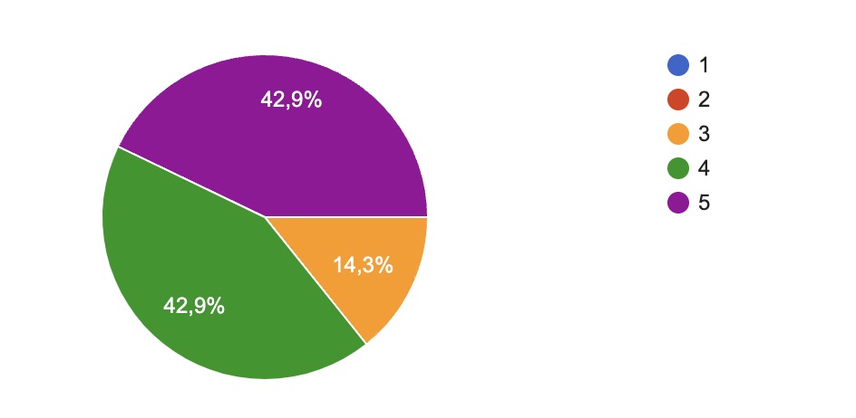

# Weekly Report - Week 1

## Week 1 Objectives

- Analyze the current state of the project
- Start working on the Functional Specification Document
- Define all the features of the project

## Week 1 Achievements

- Analyzed the current state of the project
- Started working on the Functional Specification Document
- Defined all the features of the project
- Started working on the Technical Specification Document

## Week 1 Issues and Remarques

Thanks to a google form that I will send to the team at the end of every week, I will be able to gather all the issues and remarques that the team faced during the week. This will help me to improve the project management and the team's productivity.
Here's the graphic representation of the satisfaction rate of the team:

 

### Issues

No real issues were faced during the week. The team was able to work efficiently and deliver the tasks on time.

### Remarques

- The team is very motivated and is working hard to deliver the project on time.

## Week 1 Objectives for Next Week

- Finish the Functional Specification Document
- Continue working on the Technical Specification Document
- Start working on the code of the project

## Week 1 Conclusion

This week was very productive. We managed to analyze the current state of the project, define all the features, and start working on the Functional Specification Document. The team is motivated and working efficiently. I am confident that we will be able to deliver the project on time.
