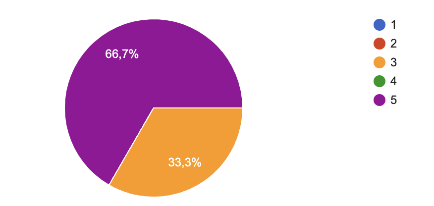

# Weekly Report - Week 3

## Week 3 Objectives
- Finish the Technical Specification Document
- Continue working on the code of the project

## Week 3 Achievements
- Finished the Technical Specification Document
- Continued working on the code of the project
- Started working on the User Manual

## Week 3 Issues and Remarques

Thanks to a google form that I will send to the team at the end of every week, I will be able to gather all the issues and remarques that the team faced during the week. This will help me to improve the project management and the team's productivity.

 

### Issues

No real issues were faced during the week. The team was able to work efficiently and deliver the tasks on time.

### Remarques

- The team is very motivated and is working hard to deliver the project on time.
- Abderrazaq is doing a great helping the team with the code of the project.

## Week 3 Objectives for Next Week

- Continue working on the User Manual
- Finish the code of the project

## Week 3 Conclusion

This week was very productive. We managed to finish the Technical Specification Document, continue working on the code of the project, and start working on the User Manual. The team is motivated and working efficiently. I am confident that we will be able to deliver the project on time.