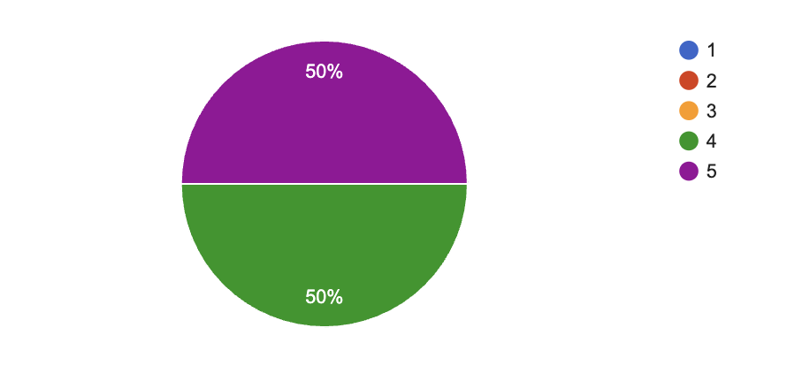

# Weekly Report - Week 4

## Week 4 Objectives
- Finish the User Manual
- finish the code of the project
- Start working on the presentation of the project

## Week 4 Achievements

- Finished the User Manual
- Finished the code of the project
- Started working on the presentation of the project

## Week 4 Issues and Remarques

 

### Issues

No real issues were faced during the week. The team was able to work efficiently and deliver the tasks on time.

### Remarques

- Abderrazaq did a great job helping the team with the code of the project.
- The team is very motivated and is working hard to deliver the project on time.
- The User Manual is very well written and will be very helpful for the users of the project.

## Week 4 Objectives for Next Week

- Finish the presentation of the project

## Week 4 Conclusion

This week was very productive. We managed to finish the User Manual, finish the code of the project, and start working on the presentation of the project. The team is motivated and working efficiently. I am confident that we will be able to deliver the project on time.
