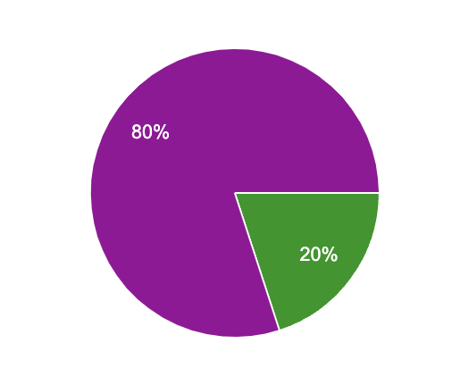

# Weekly Report - Week 5

## Week 5 Objectives

- Finish the presentation of the project

## Week 5 Achievements

- Finished the presentation of the project

## Week 5 Issues and Remarques

 

### Issues

No real issues were faced during the week. The team was able to work efficiently and deliver the tasks on time.

### Remarques

- The presentation of the project is very well done and will be very helpful for the audience.

## Week 5 Conclusion

This week was very productive. We managed to finish the presentation of the project. The team is motivated and working efficiently. The team is proud about what they have accomplished.