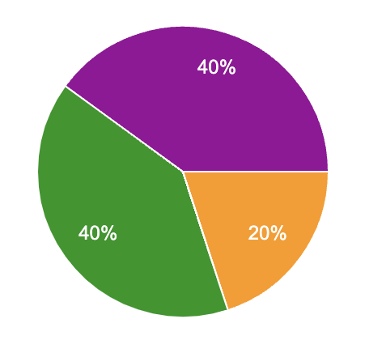

# Weekly Report - Week 2

## Week 2 Objectives

- Finish the Functional Specification Document
- Conitunue the Technical Specification Document
- start working on the code of the project

## Week 2 Achievements

- Finished the Functional Specification Document
- Continued the Technical Specification Document
- Started working on the code of the project
- Started working on the User Interface Design

## Week 2 Issues and Remarques

Thanks to a google form that I will send to the team at the end of every week, I will be able to gather all the issues and remarques that the team faced during the week. This will help me to improve the project management and the team's productivity.

 

### Issues

No real issues were faced during the week. The team was able to work efficiently and deliver the tasks on time.

### Remarques

- The team is very motivated and is working hard to deliver the project on time.
- The team is very satisfied with the project management and the way the project is going.
- The team is very satisfied with the way the project is going and is confident that we will be able to deliver the project on time.

## Week 2 Objectives for Next Week

- Finish the Technical Specification Document
- Continue working on the code of the project

## Week 2 Conclusion

This week was very productive. We managed to finish the Functional Specification Document, continue the Technical Specification Document, and start working on the code of the project. The team is motivated and working efficiently. I am confident that we will be able to deliver the project on time.
